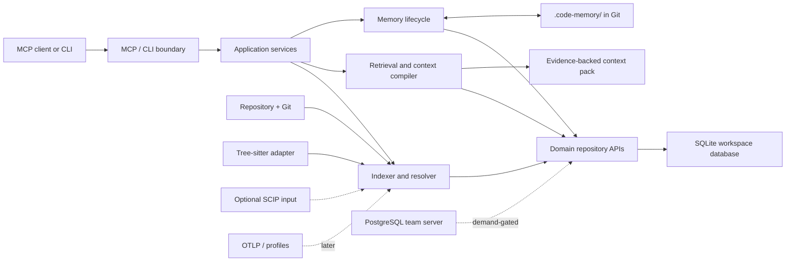

# Architecture

- Status: Proposed
- Last reviewed: 2026-07-28

## Architectural objective

RepoWitness is a local-first engine that turns source, Git history, engineering memory, and optional precision/runtime inputs into bounded, evidence-backed results for developers and coding agents.

The architecture is optimized for trust rather than maximum feature count. Its non-negotiable invariants are:

- readers observe one immutable active index generation;
- material claims carry evidence, precision, revision, and coverage;
- unresolved and skipped work remains visible;
- repository content and inferred memory are untrusted data;
- memory history is append-only in the query model;
- scope and security policy cannot be weakened by repository configuration;
- the same generation and request produce deterministic output;
- SQLite is sufficient for local operation; remote infrastructure is optional.

## System view



Dashed components are not part of the Phase 0 alpha.

## Implementation status

The solid source-indexing and retrieval path is implemented for one local
repository containing any mixture of Rust, Go, TypeScript, TSX, and Python:

```text
Git/worktree -> contained source reads -> language-specific syntax facts
    -> immutable artifacts -> owned SQLite source generation
    -> memory correspondence/revalidation -> immutable memory projection
    -> exact source/current-memory retrieval -> bounded context or diagnostics
    -> CLI or local stdio MCP
```

The production composition constructs canonical repository, Git, worktree,
manifest, snapshot, configuration, schema, grammar, producer, artifact-key,
and artifact-payload identities. A single owned writer stages bounded batches
and atomically activates complete generations; owned readers pin one active
generation. Startup migration and recovery are deadline/cancellation aware,
bound incomplete-generation cleanup to 4,096 rows, and roll back without
partial recovery. The database mutation lease, identity-checked file guard,
no-follow SQLite open, post-open path revalidation, and guarded new-file
cleanup prevent worktree database aliases or path replacement from redirecting
writes.

The implemented read path provides bounded literal `code_search`, exact
`symbol_get`, current-projection `memory_recall`, deterministic
`context_build`, and transactionally pinned `diagnostics`. These return
evidence-bearing application results rather than storage rows. Diagnostics
retains the raw Tree-sitter error/missing-node total and reports recognized
parser limitations only as a non-subtractive subset. The CLI and MCP adapters
share the same use cases, and the MCP server fixes the repository, source root,
and database at startup. Exact source declarations use labeled UTF-8 when valid
and display-safe, and lowercase hexadecimal otherwise. CLI report data is
JSON-escaped into one field, while MCP keeps the representation label and
declaration separate.

Memory ingestion now reaches an append-only local journal: the domain model,
strict YAML parser, canonical digest, and deterministic writer implement
accepted [ADR-0014](adr/0014-phase0-engineering-memory-record.md);
capability-contained worktree admission feeds a scope-checked application use
case; and the owned SQLite writer atomically appends immutable versions,
normalized children, observations, and trusted local approvals under the
implemented
[current schema](schemas/phase0-sqlite-current-v2.md). The immutable baseline
and compatible migration chain contain Rust occurrence fingerprints, Git-validity and
correspondence results, conflicts, categorical effective state, an atomically
activated current-memory projection, Python as an exact fifth persisted
language, reviewed correspondence, and exact review-event idempotency.
Application and local composition then recall only the pinned projection and
compile eligible current memory with exact source under a bounded,
evidence-bearing context contract. A contained canonical writer,
observation-only bounded Git-history import, separately trusted local approval,
and conflict-preserving correspondence review complete the Phase 0 local
management path. Broader context providers and later memory workflows remain
deferred.

## Four information planes

### Source-truth plane

Repository, workspace, package, revision, worktree, file, symbol, occurrence, and edge facts. Syntax indexing provides broad coverage; SCIP/compiler evidence can strengthen selected facts later.

### Work plane

Task objectives, hypotheses, attempts, commands, diagnostics, tests, and verification outcomes. Persisted task support follows the first alpha.

### Memory plane

Decisions, failures, procedures, episodes, preferences, policies, and non-source-derivable facts. Every record has scope, evidence, immutable versions, project validity, recorded time, lifecycle, and audit events.

### Runtime plane

Optional aggregated observations such as observed call paths, counts, latency summaries, and errors. Runtime data is always labeled as observed rather than exhaustive and is deferred until the static evidence loop is proven.

## Initial Rust workspace

The accepted Phase 0 shape is one process built from six focused packages, as decided by [ADR-0008](adr/0008-layered-modular-monolith.md):

| Package | Responsibility |
|---|---|
| `repowitness-domain` | Pure IDs, snapshots, evidence, coverage, generations, memory states, temporal logic, and invariants |
| `repowitness-analysis` | Content-to-facts extraction, resolution, correspondence, retrieval, and context-selection algorithms |
| `repowitness-application` | Use cases, request context, policy enforcement, task supervision, and narrow port traits |
| `repowitness-local` | SQLite, Git, filesystem/VFS, watcher reconciliation, local configuration, and bounded execution |
| `repowitness-mcp` | Versioned MCP DTOs, capability negotiation, error mapping, and stdio transport |
| `repowitness-cli` | Binary, commands, composition root, diagnostics, import/export, and benchmarks |

Dependency direction points inward:

```text
cli -> mcp -> application -> analysis -> domain
cli -> local -> application
             -> analysis
             -> domain
```

Analysis accepts immutable content and snapshot inputs; it does no direct filesystem or database I/O. Protocol and persistence DTOs are mapped to validated domain values at their boundaries. Tokio, Tree-sitter, `rusqlite`, Git, Serde wire types, and the MCP SDK do not appear in domain APIs.

Do not create a crate per feature, a generic repository abstraction, or a stable public Rust API by default. Add packages only for a demonstrated dependency, safety, ownership, release, or distribution boundary. See [ADR-0008](adr/0008-layered-modular-monolith.md) and the dated [architecture research](research/architecture-2026-07-22.md).

## Indexing and consistency

The indexing pipeline is bounded, content-manifested, and generation-based:

1. Resolve workspace, repository, Git object format, revision, and worktree identity.
2. Discover files while enforcing ignore, path, symlink, file-type, and size policy.
3. Build a canonical sorted manifest of exact content digests plus configuration and producer versions.
4. Reuse or create immutable content-addressed per-file analysis artifacts in bounded CPU workers.
5. Resolve generation-scoped cross-file facts after local artifacts are available.
6. Persist staging data in bounded batches through one owned SQLite writer.
7. Validate invariants, snapshot identity, producer manifest, and coverage receipt.
8. Atomically activate the generation only after validation succeeds.
9. Leave the previous generation readable if cancellation, staleness, or failure occurs.

Filesystem events are hints, never the correctness source. Native events populate a debounced dirty set; reconciliation scans and an optional polling backend detect missed events. The system applies backpressure rather than creating unbounded tasks. Clean and incremental builds of the same snapshot and producer manifest must produce equivalent logical output on golden fixtures.

The current pure domain foundation implements source-manifest contract version 1 as a file-count-bounded collection of already-validated normalized path, file-type, and content-digest components. Construction rejects over-limit input before sorting, canonicalizes unique entries by normalized-path order, rejects duplicate normalized paths, and stores the result without unused `Vec` capacity.

Source-snapshot contract version 2 composes that manifest with mandatory
repository, complete Git, worktree/submodule, resolved configuration/policy,
and analyzer/grammar/producer/schema identities. The application boundary now
distinguishes a source-manifest digest from a complete source-snapshot digest
and hashes every concrete mixed-language snapshot component in a versioned,
domain-separated encoding. Each supported language has a separate
semantics-complete artifact identity, while one combined source profile
commits to all five adapters and the exact case-sensitive
`.rs`/`.go`/`.ts`/`.tsx`/`.py`/`.pyi` selection policy. Analysis-artifact key contract
version 1 requires
source digest, adapter/grammar/producer identity, semantics-affecting
configuration, extraction schema, and canonicalization version as distinct
logical inputs. Equality and persisted digest identity change when any key
input changes. See the
[Phase 0 SQLite schema](schemas/phase0-sqlite-current-v2.md).

The pure analysis layer plans immutable artifact reuse from a canonical
manifest and a verified logical-key inventory. Planning preserves manifest
order, is bounded by the manifest limit, checks cooperative cancellation or
deadline control before allocation and after every entry, and returns no
partial plan. A changed source digest or semantics-affecting key component
requires analysis; tests prove that clean and incremental materialization are
logically equivalent for the same changed snapshot. The accepted SQLite
boundary rehashes artifact keys, verifies prepared identity, persists reusable
facts in bounded staging, and activates only a validated ready generation. The
production local composition now queries only requested complete artifacts,
validates an independent canonical payload digest and every persisted fact,
then revalidates reused spans and names against the exact current bytes.
Legacy artifacts without a payload digest are analyzed once and backfilled
only after exact row comparison. The pure plan remains independent of those
I/O effects.

The accepted [ADR-0010](adr/0010-repository-path-identity.md) separates exact
repository identity from contained host filesystem access. Repository-path
contract version 1 owns bounded exact bytes; rejects NUL, absolute, empty,
`.`/`..`/`.git`, and over-limit forms before copying borrowed input; preserves
case, Unicode form, non-UTF-8 bytes, control bytes, and backslashes; and orders
identities by unsigned bytes. Equality and hashing ignore construction limits,
and default debug output exposes counts rather than path bytes.

Accepted [ADR-0011](adr/0011-repository-path-text-encoding.md) defines the
canonical textual form as `rwp1:h:` plus strict uppercase RFC 4648 Base16.
Encoding accepts only validated repository paths. Decoding bounds the encoded
input and derived path bytes before allocation, rejects non-canonical text, and
then revalidates the domain path. The serialization-independent scalar belongs
to the application package so local and MCP adapters can wrap it in distinct
DTOs without leaking wire types into the domain. SQLite retains path bytes as
BLOBs.

Host path conversion and contained opens, file-type policy, SHA-256 digest
algorithms, fixed-width digest boundaries, and persisted path/fact encodings
are implemented. The application validates the accepted explicit
repository-ID text boundary. The local adapter constructs versioned Git and
worktree receipts from bounded sanitized Git output, fails closed on sparse
and gitlink scope, and compares captures around final path/content
revalidation.

The production Rust, Go, TypeScript, TSX, and Python profiles hash versioned
configuration and extraction schema manifests independently. Each producer
identity includes its pinned Tree-sitter package version, semantics-complete
grammar fingerprint, and exact first-party analysis, preparation,
canonicalization, and local source-adapter implementation bytes. The patched
TypeScript and TSX grammar fingerprints use exact generated parser and scanner
checksums because their node schemas do not change. The combined snapshot
profile commits to all five identities without allowing cross-language or
cross-dialect artifact reuse. The CLI
`index` composition accepts only an explicit repository ID and SQLite path,
shares one deadline and cancellation flag across preparation and publication,
checkpoints after activation, and reports non-sensitive aggregates. Generation
assembly verifies that each prepared artifact key matches the snapshot's
producer, configuration, schema, and canonicalization identity before
persistence. MCP identity composition and versioned retrieval DTOs are
implemented without leaking wire types into application or domain APIs.
Configurable profile provenance and DTOs for later Phase 0 tools remain
pending.

Tokio owns transport and orchestration. A blocking discovery/reconciliation worker owns bulk filesystem work, an explicit bounded Rayon pool owns parsing and CPU-heavy analysis, one OS thread owns the SQLite write connection, and a small bounded set of read workers each owns a read connection. No SQLite transaction survives an `.await`.

See [ADR-0006](adr/0006-immutable-index-generations.md).

## Claims and evidence

A material result contains:

- the claim;
- structured evidence identities;
- evidence tier and producer;
- categorical resolution status;
- concrete revision or worktree snapshot;
- active generation;
- warnings and limitations;
- searched, skipped, unresolved, and truncated coverage.

Evidence identity combines a repository, concrete revision or worktree snapshot, normalized repository-relative path, exact content digest, and the most specific available file, byte-span, or symbol-occurrence location. Producer identity and version are separate attribution on the evidence record. Line and column positions are for display. Dirty-worktree evidence applies only to the recorded digest.

Initial code evidence tiers are:

1. compiler or SCIP;
2. LSP;
3. direct syntax;
4. heuristic;
5. runtime observation;
6. explicit human assertion.

These categories are origins with documented limits, not universal numeric probabilities.

The current domain foundation implements semantic material-result contract version 1. It requires item-bounded evidence and notice collections, preserves supporting and contradictory evidence explicitly, and rejects resolved claims without support, resolved claims with contradictory evidence, unexplained ambiguity or indeterminacy, and unresolved outcomes that omit unresolved coverage. Evidence identity now has a typed structure, fixed-width byte offsets and lengths, validated half-open byte spans, explicit whole-file/span/symbol-occurrence locations, and a separate producer ID/version structure. Empty spans represent points or insertion boundaries; the adapter that owns the source bytes must also reject endpoints outside the referenced blob. The Phase 0 `code_search` application use case admits a bounded canonical literal query, records only its domain-separated digest in the claim, maps ordered supported-language syntax candidates to attributed symbol-occurrence evidence, pins the result to the SQLite-returned snapshot and opaque generation, adds an explicit lexical-only limitation, reports exact pre-limit match counts, and converts index omissions plus query truncation into independent coverage categories. Each occurrence carries its persisted language; that language must agree with the exact case-sensitive repository extension, and producer attribution follows the validated language instead of guessing it from the path. An empty candidate set is `unresolved`, not proof of absence. The corresponding `symbol_get` use case accepts the complete snapshot, generation, path, content, artifact, and fact-ordinal selector; requires the adapter to return that exact active context and occurrence; revalidates the path/language association, declaration bounds, and name bytes; and returns one syntax-attributed definition with explicit no-references coverage. The local adapter reads the authoritative generation mapping rather than the disposable FTS projection, then capability-contains the source read and verifies its whole-file digest before slicing the declaration. Stale generations, modified source, and inconsistent persisted language fail instead of retargeting or misattributing evidence. Repository-path and repository-ID text encodings are fixed; remaining claim, producer, generation, notice, and MCP wire encodings stay separate from persistence.

## Logical identity and correspondence

RepoWitness separates:

- a durable, assigned `LogicalSymbol` ID;
- a revision-specific `SymbolOccurrence`;
- versioned `Correspondence` evidence connecting symbols or occurrences across revisions.

Names, paths, signatures, and fingerprints are matching signals. Resolution proceeds from compiler/SCIP identity through Git-aware structural matching to language-specific heuristics. Structural differencing is evidence, not proof. High-trust memories are never silently relinked using weak heuristics. Ambiguity creates candidates and `needs_review`; splits and merges are explicit many-to-many relationships.

See [ADR-0004](adr/0004-logical-symbol-identity.md).

## Temporal memory

Memory has two time axes:

- **Project-valid time:** a claim applies at revision `R` when an introduction commit is an ancestor of `R`, no applicable invalidation commit is an ancestor of `R`, and its other scopes match.
- **System-recorded time:** immutable record versions describe what RepoWitness knew at a given time.

Branch names are selectors that resolve to commits, not durable temporal identity. Commit IDs preserve their Git object format rather than assuming SHA-1. Missing ancestry caused by shallow clones, rebases, force pushes, or pruned history yields `indeterminate`, never a guessed current answer. A memory introduced only in a dirty worktree is valid for that exact content snapshot; it does not gain descendant semantics until tied to a commit.

See [ADR-0005](adr/0005-git-dag-temporal-memory.md).

## Git-native team memory

For the local product, canonical shared records live in `.code-memory/records/<id>.yaml` in the application repository. SQLite materializes those records into append-only `memory_versions` and `memory_audit` rows for querying.

The synchronization contract requires canonical serialization, content digests, optimistic concurrency, idempotent import, explicit conflicts, tombstones, and reproducible projection rebuilds from a declared set of reachable refs and current files. Rebuilds report history coverage. Previously observed versions whose Git objects become unreachable remain in the local journal under retention policy, but surviving database loss requires a verified backup/export. Personal memory remains outside the Git repository.

See [ADR-0003](adr/0003-git-native-team-memory.md) and [ADR-0007](adr/0007-git-memory-synchronization.md).

## Storage

### Local and team-Git profiles

SQLite in WAL mode is the default. One connected workspace has one database and may contain one or many related repositories. A process-level mutation lease prevents competing index/migration owners. One dedicated thread owns the write connection; a small fixed set of workers owns read connections and closes read transactions promptly. The database lives in the platform's per-user state directory by default, not in the worktree or on a network filesystem.

The shipped or verified SQLite build must include the 2026 WAL-reset fix: SQLite 3.51.3 or newer, or a specifically documented fixed backport. Configure busy timeouts and checkpoint policy explicitly, observe WAL growth/checkpoint starvation, and use the SQLite online backup API for live backups.

Per-file source and analysis artifacts are content-addressed and immutable; generation manifests reference them. Cross-file facts may remain generation-scoped initially. Garbage collection marks from active/retained generations, pinned queries/tasks, and memory evidence before sweeping unreachable artifacts.

FTS5 provides initial text candidates. Graph traversal uses normalized typed relational tables and deterministic bounded recursive queries. Vector and separate graph databases are added only after measurements show the current design is the limiting component.

### Server profile

PostgreSQL is demand-gated by centralized concurrent writers, authenticated principals, tenant isolation, server retention, or high availability—not merely repository count or database size. A real server prototype must precede stabilization of shared domain ports. Do not create one generic storage backend interface; generation, fact, memory, and task ports remain narrow. Domain invariants may share behavior tests, while full-text search, concurrency control, locks, and performance remain backend-specific.

See [ADR-0002](adr/0002-sqlite-first.md).

## Configuration and policy

Ordinary preferences follow explicit precedence:

```text
built-in defaults
    -> selected profile
    -> user
    -> workspace
    -> repository
    -> environment references
    -> CLI
```

Security and governance use monotonic merging instead of last-write-wins. Denials are unioned, allowed roots/capabilities are intersected, numeric ceilings take the strictest value, and a lower-trust layer cannot re-enable a denied operation.

`config explain` reports value provenance and policy constraints. `doctor` validates paths, adapters, backend capabilities, credentials, and incompatible settings before indexing.

## MCP and CLI boundary

The canonical surface stays compact:

- `workspace_index`
- `code_search`
- `symbol_get`
- `graph_trace`
- `impact_analyze`
- `context_build`
- `memory_recall`
- `memory_manage`
- `task_checkpoint`
- `diagnostics`

Phase 0 implements only the subset named in the [roadmap](roadmap.md). Compatibility aliases report tool-name, schema, and behavior compatibility separately. General `query_graph` compatibility is excluded until a versioned, bounded query language and safety contract is approved.

Use a released, pinned MCP specification/SDK pair. MCP DTOs stay outside
application and domain types. Local stdio is the Phase 0 transport. The current
server pins MCP `2025-11-25` through `rmcp` 2.2.0 and exposes
`context_build`, `code_search`, `diagnostics`, `memory_recall`, and
`symbol_get` by default. It adds `memory_manage` only when startup explicitly
enables writes with one fixed validated local actor. Repository identity,
database, contained source root, actor, and resource policy are fixed at
process startup rather than accepted from tool callers. The transport rejects
a protocol line over 3 MiB; every result envelope has a bounded encoded size.
A four-permit semaphore bounds admitted repository work. Each synchronous
local operation runs on Tokio's blocking pool with a remaining deadline and
cooperative cancellation flag, while stdout remains exclusively JSON-RPC
traffic.
Product correctness does not depend on deprecated Roots, Sampling, or Logging,
and experimental MCP Tasks remain an optional negotiated projection of
application-owned task semantics.

Every query constructs a `QueryContext` with workspace, active generation, source snapshot, policy/authorization, deadline, cancellation, and explicit traversal/result/context budgets. The initial synchronous `code_search` request already carries repository, deadline, cancellation, row, and encoded-output bounds; the remaining workspace/policy fields belong in the MCP composition rather than the SQLite adapter. Pagination cursors bind to the generation and ranking-profile version; a stale cursor fails visibly.

Candidate providers return independently ranked lists. Exact identifier, FTS5, graph, Git, and memory candidates are fused deterministically before bounded expansion and context allocation. Component ranks and stable tie-breaking remain inspectable; raw scores from different providers are not treated as comparable.

## Extension boundary

Use the least powerful mechanism that solves a need:

1. declarative data or policy pack;
2. documented interchange format such as SCIP, SARIF, OTLP, or JSONL;
3. supervised out-of-process adapter with versioned DTOs;
4. optional WASI component if later justified;
5. built-in Rust only for trusted, performance-critical behavior.

RepoWitness does not promise a stable Rust dynamic-library ABI. External extension output enters as attributed evidence or a memory candidate, never as trusted truth merely because a plugin produced it.

## Security boundaries

- Local stdio is the default transport.
- Repository text, generated text, imported records, and extension output are untrusted data.
- Repository identities are validated separately from host access. Filesystem
  authorization must apply to the opened resource beneath an allowed root;
  symlink/reparse policy is explicit.
- Inputs, files, traversals, results, CPU, memory, and time have configured bounds.
- Secret scanning/redaction occurs before remote adapters, embeddings, or team-memory promotion.
- Approval actors are tied to the strongest available identity; local assertion is not represented as organization authentication.
- Remote authorization, tenant isolation, and retention are Phase 4 concerns and must be threat-modeled before implementation.

## Open architectural decisions

- Windows Git-byte conversion, reparse-point containment, and supported
  path-policy validation. Linux uses the sanitized Git CLI as the production
  adapter, `gix` as a development differential oracle, capability-contained
  opens through `cap-std`, and the accepted lossless path encoding.
- Maintained strict YAML parser and exact canonical semantic digest implementation.
- Whether source snapshots retain complete content-addressed blobs, selected searchable fragments, or digest-only content for excluded classes.
- Ratified SQLite checkpoint, read-worker, retention, and garbage-collection
  budgets. Phase 0 currently uses `synchronous=FULL` and at most 256 fact rows
  per transaction.
- The second language and build system selected from actual user demand.
- Whether LSP querying adds enough precision after SCIP import.
- The safe bounded contract, if any, for general graph queries.
- Exact release targets that support static or nearly static packaging.
- Whether centralized teams require one server node or multi-tenant operation.
