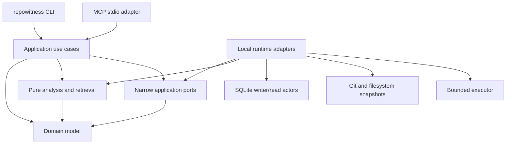

# Architecture research: local-first evidence and memory engine

- Status: Recommendation
- Research date: 2026-07-22
- Decision horizon: Phase 0 through the first public beta
- Inputs: current RepoWitness plan, primary project documentation, protocol specifications, crate documentation, and primary research papers

## Conclusion

Build RepoWitness as a **single-process, layered modular monolith** with six small Rust crates, SQLite as the local projection, exact content manifests as the snapshot model, and Git-tracked files as the initial team-memory source of record.

The key architectural unit is not a mutable property graph. It is an immutable, evidence-bearing `Generation` that points to reusable content-addressed analysis artifacts. Every query pins one generation. Every material answer identifies its source snapshot, evidence producer, coverage, and unresolved work.

Do not begin with microservices, PostgreSQL, a generic storage abstraction, a plugin ABI, Salsa as the durable index, or MCP experimental features. Preserve seams for those capabilities, but require measured demand or a passing spike before adding them.

## What to preserve—and not inherit—from the incumbent

The current `codebase-memory-mcp` repository validates several useful product choices: local single-binary operation, Tree-sitter grammar packaging, SQLite/FTS5 graph persistence, bounded structural tools, cross-repository relationships, and serious corpus-level performance measurement. Its current implementation also uses a RAM-first in-memory SQLite pipeline followed by a dump, and optionally commits a compressed SQLite graph artifact with `merge=ours` to accelerate teammate bootstrap ([upstream README](https://github.com/DeusData/codebase-memory-mcp)).

RepoWitness should preserve compatible high-value read workflows and use the incumbent as a differential/performance baseline. It should not copy the following choices as architectural invariants:

- RAM-first full indexing: benchmark it against bounded staged writes, because RepoWitness prioritizes peak-memory bounds, cancellation, incremental artifact reuse, and crash-visible generation state.
- A committed binary graph as canonical knowledge: a generated graph may later be an integrity-checked disposable cache, but team memory needs semantic diffs, conflict preservation, evidence, reproducible projection from declared reachable history, and explicit backup/export for unreachable audit retention.
- Breadth before lifecycle proof: Phase 0 validates one language and the complete source-change-to-memory-revalidation loop before adding grammar count.
- Raw general graph queries or many overlapping tools: the initial API remains typed and cost-bounded.
- Opaque multi-signal relevance as the first baseline: deterministic provider ranks and component diagnostics come before learned or embedding-heavy ranking.

This is a product fork in purpose, not a line-for-line Rust port. Compatibility is an adapter and test obligation, not the internal architecture.

## Recommended system shape



The architecture follows a useful lesson from rust-analyzer: keep analysis independent from I/O, use opaque file identities and a virtual filesystem/snapshot boundary, return syntax plus diagnostics when source is incomplete, and keep protocol serialization in the outer adapter. The rust-analyzer team also treats serializable types as stability boundaries, which is a good reason not to derive wire serialization across internal domain aggregates. See the official [rust-analyzer architecture guide](https://rust-analyzer.github.io/book/contributing/architecture.html).

## Physical Rust workspace

Start with these packages:

| Package | Owns | Must not own |
|---|---|---|
| `repowitness-domain` | IDs, snapshots, generations, evidence, coverage, memory lifecycle, temporal states, invariants | I/O, SQL, async runtime, MCP DTOs |
| `repowitness-analysis` | Content-to-facts extraction, resolution, correspondence, graph algorithms, ranking, context selection | Filesystem access, database connections, protocol types |
| `repowitness-application` | Use cases, authorization/policy checks, request context, task supervision, narrow port traits | Concrete SQLite, Git, filesystem, or MCP code |
| `repowitness-local` | SQLite, Git, filesystem/VFS, watcher reconciliation, bounded scheduling, local configuration | Product decisions or MCP schemas |
| `repowitness-mcp` | Released MCP SDK integration, wire DTOs, capability negotiation, stdio transport | SQL, parsing, Git, domain persistence |
| `repowitness-cli` | Binary, command parsing, composition root, human diagnostics | Domain logic |

Dependency direction:

```text
repowitness-cli -> repowitness-mcp
                -> repowitness-local
                -> repowitness-application

repowitness-mcp -> repowitness-application -> repowitness-analysis -> repowitness-domain
repowitness-local -> repowitness-application
                  -> repowitness-analysis
                  -> repowitness-domain
```

This is deliberately not a crate per feature. A second language can begin as a module in `repowitness-analysis`; split language packs only when dependency weight, release cadence, ownership, or optional distribution makes the boundary real. Add an FFI crate only if RepoWitness owns unsafe glue rather than consuming a safe upstream wrapper.

Use Rust 2024 Edition and virtual-workspace `resolver = "3"`; Cargo documents that a virtual workspace must set its resolver explicitly, while Resolver 3 is Rust-version aware ([Cargo workspaces](https://doc.rust-lang.org/stable/cargo/reference/workspaces.html), [Rust 2024 resolver](https://doc.rust-lang.org/stable/edition-guide/rust-2024/cargo-resolver.html)).

## Runtime and concurrency model

Use four explicit execution domains:

1. **Tokio boundary:** MCP transport, orchestration, deadlines, cancellation propagation, and shutdown.
2. **Discovery/reconciliation worker:** blocking filesystem enumeration and content-manifest construction.
3. **Owned Rayon pool:** CPU-heavy parsing, extraction, fingerprints, ranking, and bounded graph computation.
4. **SQLite actors:** one OS thread owns the write connection; a small fixed set of read workers each owns one read connection.

All queues are bounded. Backpressure is an observable state, not an excuse to spawn more tasks. Parser workers check cancellation between files and through Tree-sitter's progress callback. SQLite work is interrupted where supported and never holds a transaction across an `.await`.

Tokio explicitly warns that `spawn_blocking` tasks cannot be aborted after they start, that its blocking pool has a large default upper limit, and that long-lived blocking work should use dedicated threads; it recommends a specialized executor such as Rayon for CPU-bound work ([Tokio `spawn_blocking`](https://docs.rs/tokio/latest/tokio/task/fn.spawn_blocking.html)). An owned Rayon pool also avoids an ungoverned process-global CPU budget ([Rayon `ThreadPoolBuilder`](https://docs.rs/rayon/latest/rayon/struct.ThreadPoolBuilder.html)).

Do not use Salsa for the persistent Phase 0 index. Salsa's red-green algorithm is excellent for an in-memory revision and memoized dependency graph, but RepoWitness needs durable multi-repository generations, explicit coverage, and SQLite recovery. Reconsider Salsa only for expensive in-memory derived analysis after profiling identifies a suitable query subgraph ([Salsa algorithm](https://salsa-rs.github.io/salsa/reference/algorithm.html)).

## Snapshot and indexing model

### Exact inputs, not watcher faith

A `SourceSnapshot` is identified by:

- repository identity and Git object format;
- `HEAD` commit when available;
- a canonical sorted manifest of normalized path, file type, and content digest;
- worktree state and relevant submodule identity;
- resolved configuration and policy digest;
- analyzer, grammar, and schema versions.

The snapshot digest uses a versioned, domain-separated canonical encoding and BLAKE3. The analyzer consumes the exact bytes represented by that manifest.

Filesystem events are only dirty-path hints. Editors report different event sequences, large watches can lose events, and network filesystems may emit none; the `notify` documentation recommends polling in several of those cases ([notify known problems](https://docs.rs/notify/latest/notify/)). Native events feed a debounced dirty set, while reconciliation scans and an optional polling backend establish correctness.

### Content-addressed reuse

Use these conceptual records:

```text
source_blob(content_digest, bytes or retained text policy)
analysis_artifact(source_digest, adapter_id, adapter_version, config_digest)
artifact_fact(artifact_id, local symbols/occurrences/edges/diagnostics)
generation(snapshot_id, status, coverage, producer manifest)
generation_file(generation_id, repository_id, path, source_digest, artifact_id)
generation_fact(generation_id, cross-file/resolved facts)
workspace(active_generation_id)
```

Unchanged file content with the same analyzer inputs reuses one immutable artifact. A new generation stores a manifest, not a copy of every unchanged fact. Cross-file facts can remain generation-scoped initially; make them content-addressed only when measurements justify the additional dependency-key machinery.

This follows the core content-addressing property that an immutable object is named from its intrinsic content rather than when or how it was created ([Nix content-addressing reference](https://releases.nixos.org/nix/nix-2.24.12/manual/store/store-object/content-address.html)). RepoWitness must include every semantics-affecting analyzer input in the artifact key; source bytes alone are not sufficient.

### Generation state machine

```text
discovered -> extracting -> resolving -> validating -> ready -> active
                          \-> cancelled | failed
active -> retained -> garbage-collected
```

Activation changes one workspace pointer in a short transaction. A failed or cancelled generation is never queryable as current. Garbage collection uses mark-and-sweep from active/retained generations, pinned requests, task checkpoints, and evidence referenced by memory; reference counts alone are too fragile across crash recovery.

Clean and incremental builds of the same snapshot and producer manifest must compare equal after excluding operational metadata such as timing and row IDs.

## SQLite topology

SQLite remains the correct default for one user or a team sharing canonical memory through Git. A workspace may include several repositories; database size alone is not a reason to require PostgreSQL.

Use:

- one database per connected workspace in the platform user-state directory;
- one process-level mutation lease per workspace;
- one owned writer connection and bounded, short-lived read jobs on owned read connections;
- WAL mode, an explicit busy timeout, an explicit checkpoint policy, checkpoint/WAL-size metrics, and no read transaction across an async suspension;
- normalized typed tables for hot facts and edges, FTS5 for lexical candidates, and bounded recursive CTEs for graph traversal;
- migrations outside request handling with a checksum ledger;
- the SQLite online backup API rather than copying only the main file.

SQLite WAL allows readers and a writer to run concurrently but still permits only one writer. Long-running readers can prevent checkpoint completion and allow the WAL to grow ([SQLite WAL](https://sqlite.org/wal.html)). The same document records a rare WAL-reset corruption bug in SQLite 3.7.0 through 3.51.2, fixed in 3.51.3 and selected backports. RepoWitness must bundle or verify a fixed SQLite build before enabling the multi-connection WAL topology.

Prefer `rusqlite` with a pinned bundled SQLite and only required features so the shipped version and FTS5 behavior are predictable. `rusqlite` exposes runtime SQLite version checks, interruption, backup, and connection APIs ([rusqlite documentation](https://docs.rs/rusqlite/latest/rusqlite/)). Backups of a live database use the incremental online backup API, which produces a consistent snapshot while allowing other clients to continue ([SQLite backup API](https://sqlite.org/backup.html)).

Move to PostgreSQL only for a real centralized service requiring concurrent remote writers, authenticated principals, tenant isolation, server-side retention, or high availability. Do not implement one generic `StorageBackend` trait. Define narrow domain ports such as generation catalog, fact reader/writer, memory journal, and task journal; expose backend capabilities explicitly and keep search/concurrency behavior backend-specific.

## Source analysis and semantic precision

Tree-sitter is the broad, tolerant syntax layer. It is incremental, designed to remain useful in the presence of syntax errors, and has an official Rust binding ([Tree-sitter documentation](https://tree-sitter.github.io/tree-sitter/)). Maintain one parser instance per worker/language context and return facts plus diagnostics rather than treating any error node as total failure. Current Rust bindings expose a progress callback that can stop parsing ([Tree-sitter `ParseOptions`](https://docs.rs/tree-sitter/latest/tree_sitter/struct.ParseOptions.html)).

SCIP is a separate precision overlay, not the internal domain model. Import its occurrences, symbols, relationships, producer version, position encoding, and coverage as attributed evidence. The schema explicitly allows precision and heuristic producers to contribute complementary information, and warns that a complete index may have a large memory footprint, recommending streaming consumption ([SCIP schema](https://raw.githubusercontent.com/scip-code/scip/main/scip.proto)). Therefore imports require streaming decode, path/range validation, size budgets, and exact producer metadata.

Syntax and SCIP claims can coexist. A precise claim may supersede a syntax claim for a particular query, but it must not erase syntax coverage or make an incomplete compiler index appear complete.

## Identity and temporal memory

Keep three concepts distinct:

- `LogicalSymbolId`: opaque RepoWitness identity;
- `SymbolOccurrence`: immutable appearance in one exact source snapshot;
- `Correspondence`: evidence-backed relationship across occurrences or logical symbols.

SCIP symbols are strong producer identities within a package/index, not universal cross-history identities. The SCIP grammar says descriptors should form a fully qualified identifier across a package, while local symbols are document-local ([SCIP schema](https://raw.githubusercontent.com/scip-code/scip/main/scip.proto)). Rename tracking still needs correspondence evidence.

Correspondence is precision-first: exact producer evidence, Git/file continuity, compatible containers/signatures, structural fingerprints, then explicitly weak heuristics. It supports ambiguity, no-match, split, merge, rejection, and manual approval. Structural differencing is useful but not proof: the GumTree paper demonstrates AST-level move-aware differencing ([paper](https://hal.archives-ouvertes.fr/hal-01054552/file/main.pdf)), while later differential testing found substantial inaccurate mappings across common algorithms ([study](https://arxiv.org/abs/2103.00141)). High-trust memory therefore requires calibrated fixtures and abstention, not a single similarity threshold.

Temporal memory has two independent axes:

- project validity is evaluated through Git ancestry and exact snapshot scope;
- recorded time is the immutable sequence of what RepoWitness had observed.

Commit IDs store their object format and raw bytes rather than assuming SHA-1. Missing objects, shallow history, rewritten commits, and ambiguous ancestry produce `indeterminate`. A memory introduced only in a dirty worktree applies to that exact snapshot; it does not gain descendant semantics until tied to an actual commit. Git's `merge-base --is-ancestor` defines the ancestry test used by the CLI oracle ([Git merge-base](https://git-scm.com/docs/git-merge-base)).

Put Git behind a narrow read-only `GitHistory`/`GitWorktree` port. Run a Phase 0 spike between `gix` and direct Git CLI plumbing. `gix` offers a pure-Rust implementation and an explicit trust model for repository configuration ([gix documentation](https://docs.rs/gix/latest/gix/)); Git CLI provides stable porcelain for status and worktrees and is the differential oracle ([status](https://git-scm.com/docs/git-status), [worktree](https://git-scm.com/docs/git-worktree.html)). If the CLI adapter is used, invoke it without a shell, with explicit arguments, time/output limits, disabled prompts/pagers/hooks/fsmonitor/external diff, and sanitized configuration.

## Retrieval and context compiler

Use a deterministic two-stage design:

1. Candidate providers return independently ranked lists: exact identifier, FTS5 lexical, graph neighborhood, Git history, and applicable memory.
2. Fuse ranks, apply policy/evidence filters, perform bounded expansion, and allocate the requested context budget.

Do not compare incomparable raw provider scores. Reciprocal Rank Fusion is a simple deterministic baseline designed to combine ranked retrieval systems ([original paper](https://cormack.uwaterloo.ca/cormacksigir09-rrf.pdf)). Pin its parameters in a versioned ranking profile, specify stable tie-breaking, and retain component ranks in diagnostics.

Every request creates a `QueryContext` containing workspace, generation, snapshot, deadline, cancellation, authorization/policy, and all result/traversal budgets. Cursors include the generation and query-profile version. A stale cursor fails explicitly rather than silently moving to another generation.

Token budgets are labeled by estimator. When no client tokenizer is available, use a conservative byte/character budget and do not report it as an exact model-token count.

## MCP boundary

Use the official Rust SDK through one adapter and pin a released SDK/spec pair. The SDK is Tokio-based and supports service lifecycle and cancellation ([official MCP Rust SDK](https://github.com/modelcontextprotocol/rust-sdk)). Internal application/domain types do not depend on `rmcp` or MCP schema types.

Phase 0 uses local stdio. Authorization for HTTP is a later server concern; the MCP specification says stdio implementations should retrieve credentials from their environment rather than use the HTTP authorization flow ([MCP authorization](https://modelcontextprotocol.io/specification/2025-11-25/basic/authorization)).

Do not build product correctness around Roots, Sampling, or Logging; their official deprecation SEP is final ([SEP-2577](https://modelcontextprotocol.io/seps/2577-deprecate-roots-sampling-and-logging)). MCP Tasks remain experimental and require per-request capability negotiation and durable task creation before returning a task, so application-owned task semantics must work without them ([MCP Tasks](https://modelcontextprotocol.io/extensions/tasks/overview)). Run official conformance scenarios where they cover the selected transport and keep adapter-level golden tests for stdio ([MCP conformance framework](https://github.com/modelcontextprotocol/conformance)).

## Git-memory serialization

YAML is a human-facing representation, not the digest format.

- Parse into a strict versioned DTO, validate, then construct domain values.
- Reject duplicate keys, tags, merge keys, aliases/anchors, floats, traversal, symlinks, and over-budget depth/count/scalars unless a later schema explicitly supports them.
- Canonicalize the validated semantic object with a versioned canonical JSON profile and domain separator; hash that form with BLAKE3.
- Tool-written YAML uses deterministic formatting, but semantically equivalent human formatting produces the same digest.
- A merge record references one or more parent digests; conflicts remain first-class.

The once-common `serde_yaml` crate is deprecated ([crate documentation](https://docs.rs/serde_yaml/latest/serde_yaml/)), so parser selection needs a maintained-library spike and hostile-input corpus. RFC 8785 provides a standard JSON canonicalization scheme to evaluate for the digest form ([JCS](https://www.rfc-editor.org/rfc/rfc8785)).

## Customization without architectural erosion

Offer customization in ascending power:

1. named, versioned configuration profiles;
2. declarative language queries, ranking profiles, policies, and memory schemas;
3. imported evidence formats such as SCIP, SARIF, OTLP, and JSONL;
4. supervised out-of-process adapters with versioned DTOs and budgets;
5. optional WASI components only after a sandboxing/performance spike;
6. built-in Rust for trusted behavior that needs tight integration.

Configuration can tune behavior but cannot weaken evidence, path scope, atomic publication, or resource limits below administrator policy. Avoid a Rust dynamic-library ABI and avoid loading repository-supplied native code into the process.

## Alternatives rejected for Phase 0

| Alternative | Why not now | Revisit trigger |
|---|---|---|
| One large crate | Fastest bootstrap but permits SQL, protocol, I/O, and domain concerns to entangle | Never as the intended architecture; temporary scaffold only |
| Microservices | Adds network consistency, deployment, auth, and observability before a local loop exists | Centralized product with independently scaled workloads |
| PostgreSQL first | Makes local use operationally heavier and predicts an unproven server workload | Multiple remote users/writers or organizational controls |
| Event-source the entire code graph | Replay/materialization cost exceeds the value for derived, rebuildable source facts | A demonstrated audit/replay requirement that generations cannot meet |
| Salsa as durable index | In-memory revision model does not replace persistent snapshots and recovery | Profiled expensive derived queries inside one active process |
| Generic plugin ABI | Stabilizes unsafe/extremely broad contracts before core semantics | At least two real adapters cannot use interchange or subprocess boundaries |
| Vector database | Adds another consistency boundary before lexical/structural retrieval is measured | Evaluations show a recall gap that vectors close without unacceptable stale answers |
| General Cypher/SQL MCP tool | Difficult to bound, secure, version, and make portable | A typed, costed, read-only query language with conformance fixtures |

## Phase 0 architecture spikes and gates

Before broad implementation, complete these in order:

1. **Snapshot/artifact spike:** index a fixture twice, change one file, prove immutable artifact reuse and clean/incremental logical equivalence.
2. **SQLite ingestion/crash spike:** benchmark bounded direct staging writes against a private RAM-first staging database on the same corpora, then kill the process during every generation state; prove the old active pointer remains readable, recovery cleans staging data, backup/restore works, peak-memory budgets hold, and the bundled SQLite is a WAL-reset-fixed version.
3. **Git spike:** compare `gix` and sanitized Git CLI results for normal repo, worktree, shallow clone, missing object, SHA-256 repo, rename, and malicious configuration fixtures.
4. **Identity spike:** run rename, move, body edit, signature edit, copy, split/merge, delete/reintroduce, and ambiguous duplicate fixtures; measure false relinks separately from abstentions.
5. **MCP boundary spike:** stdio initialization, cancellation, malformed input, output budgets, clean shutdown, and applicable conformance/golden tests.
6. **Memory format spike:** canonical semantic hashing across YAML formatting, duplicate/alias/tag rejection, conflict parents, tombstones, shallow history, and projection rebuild.
7. **Retrieval baseline:** compare exact+FTS5+graph+memory RRF against lexical-only and naive-memory baselines with relevant lines per budget and stale-answer rate.
8. **Rust go/no-go slice:** compare correctness, resource use, package reliability, and maintainability against the incumbent where behavior overlaps.

No spike should silently choose a library. Record its corpus, versions, measurements, failures, and decision in an ADR before the dependent surface stabilizes.

## Implementation follow-up — 2026-07-26

- Snapshot/artifact reuse, clean-versus-incremental equivalence, SQLite
  generation/crash/backup behavior, sanitized Git discovery, canonical
  repository/source identity, the bounded FTS5 candidate, and the local stdio
  MCP boundary are implemented and covered by regression tests.
- The production path now indexes real Rust repositories through the CLI,
  persists and reuses exact artifacts in SQLite, returns evidence-bearing
  `code_search` results, and retrieves digest-verified declarations through
  `symbol_get`. The same use cases pass installed-binary MCP round-trips.
- The strict memory-format spike passes as test-only research. The complete
  production record remains blocked on proposed
  [ADR-0014](../adr/0014-phase0-engineering-memory-record.md).
- The identity/correspondence, memory revalidation, context compiler, retrieval
  baseline, and final Rust go/no-go gates remain. Passing the source indexing
  and retrieval foundation does not satisfy the end-to-end Phase 0 goal.

## Decisions still open after implementation

- Windows path conversion and containment; Linux production uses sanitized Git
  with `gix` retained as a development differential oracle.
- Production promotion of a maintained strict YAML parser and exact canonical
  JSON implementation after ADR-0014 and its gates.
- Snapshot source-retention policy: complete content-addressed blobs, searchable fragments, or digest-only for selected files.
- Ratified SQLite checkpoint, read-worker, retention, and garbage-collection
  budgets after pinned-corpus measurements.
- Rust occurrence correspondence and meaning-change features beyond the
  implemented direct-syntax extraction schema.
- Public crate/API policy; initial packages should remain private workspace packages unless reuse is demonstrated.
