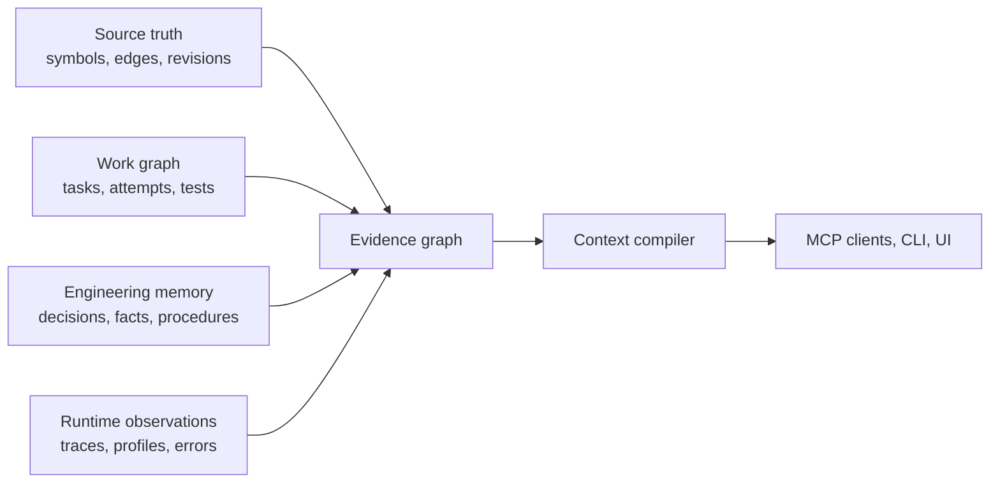

# RepoWitness — Rust Codebase Intelligence and Engineering Memory

Status: research-backed product and implementation plan
Date: 2026-07-22
Product name: **RepoWitness**
Tagline: **Verified engineering memory for coding agents**

Focused product, architecture, engineering, roadmap, glossary, and decision documents now live under [`docs/`](docs/README.md). The current primary-source architecture review and implementation spikes are in [`docs/research/architecture-2026-07-22.md`](docs/research/architecture-2026-07-22.md). Accepted ADRs and those focused documents take precedence over this research reference where they cover the same decision.

## 1. Executive decision

Build **RepoWitness** as a new Rust implementation, but do not position it merely as a faster rewrite of [`codebase-memory-mcp`](https://github.com/DeusData/codebase-memory-mcp).

The strongest product is a **local-first, temporal engineering graph** that connects:

- source symbols and their relationships;
- commits, branches, worktrees, ownership, and architecture decisions;
- durable project knowledge and agent memories;
- attempts, commands, test results, and other proof of work;
- optional runtime traces and profiles mapped back to source.

Its defining promise should be:

> Every retrieved fact explains where it came from, how precise it is, when it was true, and what could invalidate it.

This is more defensible than competing on language count or MCP tool count. Existing projects already provide native Rust, tree-sitter indexing, graph traversal, semantic search, security scanning, or basic memories. The distinctive value is the integration of **temporal state, evidence, validation, and memory lifecycle**.

### Naming convention

- Product and GitHub repository: `RepoWitness` / `repowitness`
- CLI binary: `repowitness`
- MCP server package: `repowitness-mcp`
- Rust crates: `repowitness-*`
- Short description: **A temporal, evidence-backed code-intelligence and memory engine**
- Portable team-memory directory: `.code-memory/`, deliberately independent of product branding

The name combines **repository** with **witness**: the system does not merely remember claims; it shows what source, history, tests, and runtime observations can substantiate them.

## 2. Why build this and what makes it unique

### One-sentence product definition

> RepoWitness gives coding agents verified, revision-aware knowledge of how a project works, what has already been tried, and whether that knowledge is still valid.

### The problem worth solving

Coding agents repeatedly lose expensive engineering context. Across sessions and developers, they often:

- rediscover the same architecture and conventions;
- repeat approaches that already failed;
- trust documentation or memories that no longer match the current branch;
- retrieve many related files without identifying the smallest useful working set;
- confuse a likely syntactic relationship with a compiler-confirmed fact;
- lose hypotheses, commands, diagnostics, and verification results when a task ends;
- treat generated summaries as truth even when they have no supporting evidence.

This wastes tokens and developer time, but the more serious problem is trust: an agent may act confidently on incomplete or stale context.

Most code-intelligence tools answer “what does the repository look like now?” Most agent-memory tools answer “what text was previously stored?” Neither reliably connects source truth, project history, previous work, and verification. As a result, they cannot consistently answer:

- Was this fact true on this branch and at this revision?
- Is it compiler-derived, syntactically inferred, observed at runtime, or merely remembered?
- Did the last attempted fix pass tests?
- Did a rename make this memory stale, or does it still refer to the same logical symbol?
- Which relevant areas could not be resolved or searched?
- When two memories disagree, which evidence wins?

The project should answer those questions explicitly. Its core abstraction is not “a vector database for code.” It is a graph of engineering claims with provenance and time.

### Why existing categories are insufficient

```text
Code search and graphs      know source, but forget engineering experience
Agent-memory systems        remember text, but rarely understand code evolution
Git and issue trackers      preserve history, but do not compile agent-ready context
Observability platforms     know runtime behavior, but are disconnected from code memory

This project connects all four through shared symbol identity, time, and evidence.
```

### What is unique

No individual ingredient should be claimed as entirely new. Graph search, temporal memory, SCIP, agent checkpoints, and trace ingestion all exist independently. The defensible product is their integration into one validation loop:

```text
Source change
    -> incrementally update code facts
    -> identify affected memories, tasks, tests, and runtime mappings
    -> revalidate, preserve, contradict, or mark knowledge stale
    -> compile a new evidence-backed context pack
    -> record the next verified success or failure
```

That loop creates the distinctive capabilities:

1. **Proof-carrying answers.** Results state their evidence, precision source, revision, generation, categorical resolution status, limitations, and search coverage.
2. **Memory that understands refactors.** Knowledge attaches to logical symbols, follows supported renames and moves, and becomes stale after meaning-changing edits.
3. **Verified agent experience.** Successful procedures and failed approaches are stored with tests, diagnostics, commands, environment, and approval evidence—not inferred from chat alone.
4. **Bitemporal knowledge.** The system separately records when knowledge was captured and when it was valid in the project.
5. **Static and observed behavior.** Static analysis describes possible relationships; optional runtime evidence describes paths actually observed without confusing the two.
6. **Token-budgeted context compilation.** Agents receive a compact working set of code, tests, history, and memory plus an explicit receipt for omissions and unresolved areas.
7. **Reviewable and scoped memory.** Team knowledge is Git-reviewable, while personal knowledge remains local; repository, branch, worktree, path, symbol, user, and team scopes are enforced.
8. **Progressive semantic precision.** Fast tree-sitter results work broadly, while compiler/SCIP evidence strengthens answers where available.

### Why build it now

- Coding agents are increasingly limited by context quality and continuity, not only model capability.
- MCP provides a common delivery protocol rather than requiring integrations for every client.
- SCIP provides an open path to compiler-grade intelligence without building every compiler frontend.
- Local SQLite, tree-sitter, Git, and Rust make a private, single-binary product practical.
- Experimental MCP Tasks offer a negotiated durable-operation projection, while MCP Apps can provide optional evidence-review interfaces; neither is required for core correctness.
- Existing competitors validate demand, but the field remains fragmented across search, graph, memory, and observability products.

### Expected user outcome

The product succeeds when an agent can start or resume a task with fewer tool calls and less context, avoid an already disproven approach, identify when prior knowledge is stale, and justify its conclusions with inspectable evidence.

### Proposed long-term moat

The moat should come from quality and accumulated trust, not proprietary lock-in:

1. **Validated engineering history.** Over time, each project accumulates evidence-linked decisions, procedures, failures, and symbol correspondence that make future work faster. Users retain ownership through exportable, Git-friendly records.
2. **A mature lifecycle engine.** Correctly detecting when knowledge remains applicable, becomes stale, conflicts, or follows a refactor is harder to reproduce than storing and embedding text.
3. **Measured context quality.** A growing public evaluation corpus and ranking telemetry can improve relevant-lines-per-token, abstention, and confidence calibration.
4. **Language and evidence adapters.** Reusable tree-sitter, SCIP, build-system, Git, test, ownership, and telemetry adapters compound coverage without weakening the common evidence model.
5. **Compatibility and operational trust.** Stable MCP contracts, local-first privacy, deterministic results, recoverable migrations, and transparent coverage can make the server dependable infrastructure rather than another experimental agent tool.

Several individual ideas, including architecture drift and trace ingestion, already appear in the incumbent project's [roadmap issue](https://github.com/DeusData/codebase-memory-mcp/issues/398). The differentiation is therefore the coherent evidence and lifecycle model, not any isolated feature.

## 3. Goals and non-goals

### Goals

- Provide useful indexing within seconds and incrementally update only affected facts.
- Maintain durable logical identities where evidence supports them, with explicit correspondence, ambiguity, and review across edits, renames, branches, and worktrees.
- Support broad syntax-aware indexing and opt-in compiler-grade precision.
- Return compact, deterministic, source-linked results suitable for coding agents.
- Make uncertainty and incomplete coverage visible instead of silently guessing.
- Store durable project knowledge without turning old chat into untrusted truth.
- Work completely locally by default, with no required LLM or cloud service.
- Support versioned configuration and well-defined extension points without weakening evidence, isolation, or consistency guarantees.
- Expose a small, composable MCP surface plus CLI/library interfaces.
- Offer a schema-tested compatibility profile for bounded, high-value incumbent tool names and result shapes.
- Be observable, benchmarkable, crash-safe, and straightforward to distribute as a native binary, with static or nearly static packaging claimed only for tested targets.

### Non-goals for the first public beta

- Matching the incumbent's claimed 158-language coverage.
- Implementing a new language server or compiler frontend for every language.
- Becoming an autonomous coding agent.
- Automatically treating every conversation as durable memory.
- Requiring embeddings, a graph database, a hosted account, or network access.
- Competing through dozens of narrowly differentiated MCP tools.
- Performing automatic source rewrites before the index and evidence model are trustworthy.

## 4. Why Rust?

### Recommendation

Use Rust for the indexing engine, storage/retrieval core, CLI, and MCP server. Use TypeScript only for the optional MCP App frontend. Continue consuming C-based tree-sitter parsers through a narrow, audited boundary, and consume external SCIP indexes rather than rewriting compiler integrations.

Rust is justified by the workload, not by fashion. This product is a long-running local process that parses large amounts of untrusted source, maintains a memory-sensitive graph, executes CPU-heavy work in parallel, writes transactional state, and exposes a protocol boundary. That is unusually close to Rust's strengths.

### Concrete advantages for this product

1. **Memory and thread safety at the engine boundary.** Rust's ownership model provides memory safety without a garbage collector, while `Send` and `Sync` move many concurrency mistakes to compile time. This matters when file watchers, parsers, graph workers, task cancellation, and database readers operate concurrently. See the official Rust material on [ownership](https://doc.rust-lang.org/stable/book/ch04-01-what-is-ownership.html) and [concurrency](https://doc.rust-lang.org/book/ch16-00-concurrency.html).
2. **Predictable local resource use.** Rust has no managed-language runtime or GC, giving the engine direct control over allocation, cache layout, and backpressure. That helps a background MCP server remain responsive while indexing a large monorepo. It does not guarantee that a Rust implementation will be fast; profiling and allocation discipline still decide that.
3. **Good fit for mixed CPU and I/O work.** Tokio can handle MCP transports, cancellation, and task orchestration, while Rayon or bounded workers handle parsing and graph computation. Tokio's own guidance says CPU-heavy work and bulk file reads should not run on its async workers, which supports the split architecture in this plan: [Tokio: when not to use Tokio](https://tokio.rs/tokio/tutorial#when-not-to-use-tokio) and [Rayon](https://github.com/rayon-rs/rayon).
4. **First-class tree-sitter path.** Tree-sitter lists Rust among its [official bindings](https://tree-sitter.github.io/tree-sitter/using-parsers/). The binding wraps the existing C runtime, so the rewrite can retain the proven parser ecosystem without exposing C memory management throughout the application.
5. **Strong ecosystem alignment.** The design already depends on an [official MCP Rust SDK](https://github.com/modelcontextprotocol/rust-sdk), `rusqlite`, SCIP Rust bindings, Serde, tracing/OpenTelemetry, and potentially Salsa. These are natural interfaces rather than custom bridges.
6. **Simple distribution.** Cargo produces native release binaries without requiring users to install Node or a VM. Cross-platform release engineering is still real work—especially C grammar compilation, libc choices, code signing, and Windows behavior—but the resulting user experience can be one executable plus its database.
7. **Expressive invariants.** Newtypes and enums can distinguish logical symbol IDs from occurrences, active generations from staging generations, trusted evidence from candidates, and personal scope from team scope. Making invalid states difficult to represent is particularly valuable for temporal data and privacy boundaries.
8. **Better security direction than expanding the C core.** CISA recommends memory-safe-language roadmaps for software handling attack surface. Rust does not make C parsers or `unsafe` blocks safe automatically, but it sharply reduces the area requiring manual memory-safety review. See [CISA's memory-safe roadmap guidance](https://www.cisa.gov/resources-tools/resources/case-memory-safe-roadmaps).

### What Rust does not solve

- It does not correct faulty graph semantics, resolution heuristics, SQL design, or memory poisoning.
- It cannot protect code inside incorrect `unsafe` blocks or bugs in C/C++ tree-sitter grammars and native libraries.
- It does not make async code automatically fast; blocking SQLite and CPU parsing must remain off Tokio workers.
- It does not remove the need for query budgets, fuzzing, transaction boundaries, or crash recovery.
- It can slow initial development through ownership/lifetime design, longer builds, smaller hiring pools, and immature edges in some libraries.
- Rewriting a working C implementation creates parity and regression risk. Compatibility must be measured, not assumed.

### Alternatives

| Choice | Strongest case | Main cost for this product | Decision |
|---|---|---|---|
| **Rust** | Native local engine with high throughput, controlled memory, parallel parsing, and safety boundaries | Learning curve, compile time, FFI audits, and a younger MCP SDK | Recommended for core and server |
| **Keep/extend C** | Lowest rewrite cost and direct reuse of the incumbent implementation | Manual memory/concurrency safety and higher cost of evolving a large stateful, network-capable system | Use as behavior/performance baseline; port tests and algorithms selectively |
| **Go** | Fast team development, excellent server operations, simple concurrency, mature [official MCP SDK](https://github.com/modelcontextprotocol/go-sdk) | Managed runtime/GC and more friction around C-heavy parser integrations; the [Go GC](https://go.dev/doc/gc-guide) explicitly trades CPU for heap overhead | Best fallback if team throughput dominates local resource control |
| **TypeScript/Node** | Fastest MCP/API iteration and strongest fit for the interactive UI; mature [official MCP SDK](https://github.com/modelcontextprotocol/typescript-sdk) | GC/runtime footprint, CPU-parallel worker complexity, native addon/grammar packaging, and still-evolving [single-executable support](https://nodejs.org/api/single-executable-applications.html) | Use for the MCP App UI, not the indexing core |
| **Hybrid C core plus higher-level server** | Reuses the incumbent and isolates protocol work | Two languages, ownership across FFI, duplicated data models, harder debugging and release builds | Accept only as a temporary migration bridge |

### When not to choose Rust

Choose Go or keep the existing C implementation if the Phase 0 prototype shows any of the following:

- no maintainer can confidently review ownership, concurrency, `unsafe`, and performance-sensitive Rust;
- the real product is primarily a hosted I/O service rather than a local indexing engine;
- tree-sitter/SQLite/native packaging makes cross-platform releases less reliable than the existing implementation;
- the rewrite cannot reach behavioral parity without delaying the differentiating memory work substantially;
- measured throughput, peak RSS, incremental latency, or binary startup fail the agreed budgets with no clear fix.

### Rust decision gate

Before committing to a full rewrite, build one vertical slice:

```text
discover repository -> parse Rust -> persist one atomic generation
-> search/context over MCP -> attach one decision or failure memory
-> rename or meaningfully edit its symbol -> revalidate memory
-> incrementally update -> verify clean-build equivalence and evidence receipt
```

Benchmark it on the same pinned repositories and hardware against the incumbent C implementation where behavior overlaps, plus lexical/source-only and naive-memory baselines. Record:

- cold and incremental indexing time;
- P50/P95 query latency;
- peak and steady-state RSS;
- database and binary size;
- startup time;
- extraction parity and unresolved-edge counts;
- crashes/fuzzer findings;
- amount and location of `unsafe` code;
- engineering effort for the complete vertical slice.

Proceed with Rust only if it satisfies the correctness and resource budgets defined in Phase 0 and the team can maintain the result. The benchmark is a go/no-go architecture gate, not a promotional performance comparison.

## 5. Landscape and lessons

| System or standard | What it establishes | Consequence for this project |
|---|---|---|
| [`codebase-memory-mcp`](https://github.com/DeusData/codebase-memory-mcp) | Broad tree-sitter indexing, SQLite graph storage, hybrid LSP resolution, architecture and impact tools, cross-repository work | Preserve familiar workflows, but fix workspace correctness, silent limits, and lifecycle semantics rather than copying feature count |
| [Sourcegraph precise navigation](https://sourcegraph.com/docs/code-navigation/precise-code-navigation) and [SCIP](https://github.com/scip-code/scip) | Language-neutral interchange for compiler-derived definitions and references | Import SCIP as the primary precision path; do not reimplement every compiler integration |
| [Serena](https://github.com/oraios/serena) | LSP-oriented semantic editing and a simple persistent memory mechanism | Basic “code tools plus memories” is already available; provenance and invalidation must be substantially stronger |
| [CodeGraph](https://github.com/suatkocar/codegraph), [Codanna](https://docs.codanna.sh/), and [Narsil](https://github.com/postrv/narsil-mcp) | Rust code-intelligence servers already cover graphs, languages, vectors, security, and many tools | Rust itself is an implementation advantage, not a differentiator |
| [Probe](https://github.com/probelabs/probe) and [Aider repository maps](https://aider.chat/docs/repomap.html) | Deterministic, token-aware retrieval and graph ranking are valuable to agents | Treat context construction and token efficiency as first-class product behavior |
| [Graphiti](https://github.com/getzep/graphiti) | Temporal facts, episodes, provenance, and invalidation are practical memory primitives | Borrow the temporal model while keeping deterministic, local extraction as the default |
| [LangMem concepts](https://langchain-ai.github.io/langmem/concepts/conceptual_guide/) and [Letta context hierarchy](https://docs.letta.com/guides/core-concepts/memory/context-hierarchy) | Semantic, episodic, and procedural memories need different storage and retrieval policies | Define explicit memory kinds and compile a small active context from a larger archive |
| [MCP Tasks](https://modelcontextprotocol.io/extensions/tasks/overview) | An experimental extension defines durable handles for long-running operations when both peers opt in | Keep task semantics application-owned; optionally project indexing, imports, and revalidation through negotiated MCP Tasks |
| [MCP Apps](https://github.com/modelcontextprotocol/ext-apps) | Tools can expose sandboxed interactive interfaces with text fallbacks | Add an optional Evidence Workbench after the text API is stable |
| [OpenTelemetry code attributes](https://opentelemetry.io/docs/specs/semconv/registry/attributes/code/) and [profiles](https://opentelemetry.io/docs/specs/otel/profiles/) | Runtime observations can be correlated with functions, files, traces, and services | Add privacy-preserving runtime overlays without storing application payloads by default |

### Important competitive conclusion

Do not pursue a tool-count arms race. A stable surface of roughly 8–12 composable tools will consume less model context, be easier to secure, and be easier for clients to learn. Capability depth should live in structured modes, resources, and reusable result schemas.

## 6. Users and primary jobs

### Coding agent

- Find the smallest relevant working set for a task.
- Trace definitions, references, callers, data flow, tests, and owners.
- Know what is precise, inferred, stale, or unresolved.
- Resume previous work without repeating failed approaches.
- Checkpoint a hypothesis and attach proof when it succeeds or fails.

### Developer

- Understand an unfamiliar repository or monorepo quickly.
- Review and correct project memories before they influence agents.
- Compare architecture across revisions and worktrees.
- See which runtime paths or hot spots correspond to source symbols.
- Keep local/private knowledge separate from shared team knowledge.

### Team or platform owner

- Publish conventions, decisions, and runbooks in a reviewable format.
- Detect drift between documented decisions and implementation.
- Measure index coverage and retrieval quality across languages.
- Apply path, secret, retention, and access policies.

## 7. Design principles

1. **Evidence before eloquence.** Prefer a smaller supported answer over a broad unsupported claim.
2. **Abstention is a feature.** Return unresolved symbols, skipped files, and precision/resolution limits.
3. **Current source is authoritative for code facts.** Memories add context but do not override contradictory indexed evidence silently.
4. **Everything derived is versioned.** Facts belong to an immutable index generation and revision/worktree view.
5. **Stable logical identity, immutable physical occurrence.** A symbol can persist while its file location changes.
6. **Local and deterministic by default.** LLM extraction and embeddings are optional adapters.
7. **Progressive precision.** Return fast syntax results, then enrich them with SCIP, Git, tests, or runtime observations.
8. **No silent truncation.** Every cap is configurable and reported in the coverage receipt.
9. **Memory must earn trust.** Inferred memories begin as candidates, not facts.
10. **Open formats at the boundaries.** Use SCIP, OTLP, SARIF where appropriate, MCP, SQLite, and reviewable text records.

## 8. Conceptual model

The system contains four connected planes:



### Source-truth plane

Files, packages, symbols, definitions, references, calls, imports, routes, infrastructure resources, tests, ownership, revisions, and worktree overlays.

### Work plane

Tasks, hypotheses, attempts, commands, patches, diagnostics, test runs, approvals, and outcomes. This plane provides the evidence needed to learn useful procedures without confusing an attempted change with a successful one.

### Memory plane

Facts, decisions, procedures, episodes, failures, preferences, and policies. Memory records have scopes, validity semantics, provenance, assurance state, and lifecycle state.

### Runtime plane

Aggregated trace edges, profiles, error counts, latency, and deployment/service identity. Runtime facts are observations—not proof that unobserved static paths are impossible.

## 9. Core feature set

### P0: trustworthy code graph

- Rust core with incremental tree-sitter parsing.
- First-class repository, workspace, package, branch, revision, and worktree identities.
- Definitions, references, imports, calls, inheritance/implementation, tests, routes, and configuration links.
- File-level invalidation followed by affected-query recomputation.
- Immutable staging generation and atomic activation, so readers never see a half-built graph.
- Coverage diagnostics for unsupported grammars, parse errors, unresolved references, ignored paths, file-size limits, and result truncation.
- Schema-tested compatibility aliases for high-value bounded read calls such as `index_repository`, `search_graph`, `get_code_snippet`, `trace_path`, and `get_architecture`. `query_graph` is excluded from the initial profile until its query language and safety contract are explicitly defined.

### P0: dual precision tiers

Each edge records its precision origin:

- `compiler` or `scip`: authoritative within the producer's documented limits;
- `lsp`: obtained from a live language server;
- `syntax`: directly supported by a syntax tree;
- `heuristic`: inferred by naming, path, or project rules;
- `runtime`: observed dynamically;
- `human`: explicitly asserted and approved.

The default path is fast syntax indexing. A SCIP document can later replace or reinforce relevant edges without rebuilding unrelated data. The [SCIP indexer guidance](https://sourcegraph.com/docs/code-navigation/writing-an-indexer) should define interchange tests and occurrence semantics.

### P0: proof-carrying retrieval

Every material result returns:

```json
{
  "claim": "orders.Create calls payments.Authorize",
  "evidence": [{
    "uri": "source://repo/rev/file.rs#L81-L89",
    "content_digest": "blake3:...",
    "producer": "scip-rust"
  }],
  "precision": "scip",
  "resolution_status": "confirmed",
  "generation": 42,
  "revision": "git:abc123",
  "validity": "current-worktree",
  "warnings": [],
  "coverage": {
    "searched": 1842,
    "skipped": 3,
    "unresolved_edges": 7,
    "truncated": false
  }
}
```

Initially expose categorical precision, resolution status, evidence, warnings, and coverage rather than a probability-like confidence number. A numeric score may be added only after a documented labeled corpus demonstrates calibration by evidence class and language; it must not be an arbitrary decorative number or be used to hide unresolved data.

An evidence record combines a source identity with separate producer attribution. The source identity contains repository ID, concrete revision or worktree snapshot, normalized path, blob/content digest, and an explicit whole-file, half-open byte-span, or symbol-occurrence location. Producer identity and version remain separate fields. Line/column fragments are display metadata, not durable identity. Evidence against dirty worktree content is valid only for the recorded content digest and becomes stale when that digest changes.

### P0: context compiler

`context_build` accepts an intent, scope, and token budget. It should:

1. resolve obvious symbols and paths;
2. retrieve lexical, structural, history, and memory candidates in parallel;
3. fuse ranks deterministically, initially with reciprocal-rank fusion;
4. expand only high-value graph neighbors;
5. penalize stale, weak, duplicated, and overly broad evidence;
6. allocate the budget across definitions, dependencies, tests, history, and memories;
7. return the evidence pack plus omissions and coverage.

The output should be stable for the same generation and request. Embeddings can improve candidate recall later, but cannot be the sole retrieval path.

### P0 foundation / P1 expansion: engineering memory

The Phase 0 walking skeleton supports `decision` and `failure`; Phase 3 broadens the same record and lifecycle contract to all supported kinds:

- `fact`: durable domain or implementation knowledge;
- `decision`: a choice, rationale, alternatives, and status;
- `procedure`: repeatable steps with prerequisites and verification;
- `episode`: what happened during a task or incident;
- `failure`: an attempted approach and why it failed;
- `preference`: user or team working preference;
- `policy`: an enforced project rule.

Recommended record:

```yaml
id: mem_01J...
kind: decision
scope:
  repository: payments
  branch: main
  paths: [src/ledger/**]
  symbols: [rust:ledger::append]
content: "Ledger writes must remain append-only."
source: human
assurance: approved
status: active
display_revision: 1
parent_revision_digests: []
project_validity:
  introduced_by: [git:8e42...]
  invalidated_by: []
recorded_at: 2026-07-22T15:00:00Z
recorded_until: null
evidence:
  - adr://payments/0042
  - source://payments/8e42/src/ledger.rs#L20-L63
supersedes: []
ttl: null
```

Lifecycle:

```text
candidate -> validated -> active -> stale -> superseded
                   \-> quarantined
active <-----------> contradicted
```

- Raw conversations are never auto-promoted to active memory.
- Facts directly derivable from the indexed source remain source-plane claims rather than duplicated memory. The `fact` kind is reserved for durable domain context or externally established knowledge that cannot be recovered reliably from the current tree.
- Deterministic extraction from commits, ADRs, tests, and config is preferred.
- Model-generated memories require provenance and approval policy.
- Conflicting records are preserved and surfaced; last-write-wins is insufficient.
- Deletion defaults to a reversible tombstone with an audit event.
- Changes to cited symbols or evidence trigger targeted revalidation.

#### Temporal semantics

RepoWitness uses two distinct time axes:

- **Project-valid time:** whether a claim applies to a queried repository revision. Because Git is a DAG, `introduced_by` and `invalidated_by` are commit sets interpreted through ancestry, not a single linear interval. A claim is eligible at revision `R` when at least one introduction commit is an ancestor of `R`, no applicable invalidation commit is an ancestor of `R`, and repository/worktree/path/symbol scope also matches.
- **System/recorded time:** what RepoWitness knew at a given time. Records are never updated destructively in the query model. An edit creates an immutable record revision with a system-visibility interval, links zero or more parent digests in a version DAG, and emits an audit event; conflicts may leave several candidates visible until review.

Branch names are user-facing selectors, not durable temporal identity because they move. Queries resolve a branch or worktree to a concrete revision before validity evaluation. Rebase, cherry-pick, shallow-history, missing-ancestor, and force-push behavior must return an explicit `indeterminate` validity state when ancestry cannot be proven. Supersession and contradiction are relationships between immutable record revisions; neither silently rewrites historical truth.

### P0 foundation / P1 expansion: Git-native team memory

- Canonical shared records live under a configurable `.code-memory/` directory as one stable YAML file per record.
- SQLite is a query projection, not the sole copy of current team knowledge; retained unreachable observations still require backup/export for durable audit continuity.
- Pull requests can review memory changes alongside source changes.
- Record-level files minimize merge conflicts.
- Personal memories remain outside the repository in a local, optionally encrypted store.
- Repository policy decides which memory kinds can be shared and who can approve them.

#### Git-memory synchronization contract

The first release stores team memory in the application repository. A separate policy repository is a later server/organization option and must not complicate the local alpha.

- Each record has an immutable ID. Its current canonical representation is `.code-memory/records/<id>.yaml`; edits increment a display-only `display_revision` and link zero or more `parent_revision_digests` in a version DAG.
- UTF-8, LF endings, schema versioning, normalized paths, deterministic key ordering, and canonical content hashing make generated changes reviewable and reproducible.
- Reachable Git history is the portable transaction history for shared records. Import materializes every observed version into append-only SQLite `memory_versions` and `memory_audit` rows; personal records use the same append-only model locally.
- Import is idempotent by record ID, canonical content digest, and source commit. Current state is reproducibly projected from a declared set of reachable Git refs plus current files, and rebuilds report the history coverage they actually inspected.
- An ordinary update uses the expected current digest as its one parent; a reviewed merge references every chosen parent. Parent digests, not display revisions, enforce optimistic concurrency. Conflicting Git versions remain explicit conflicts requiring review; RepoWitness does not choose semantic last-write-wins.
- Deletion is represented by a tombstone record. Missing files, rewritten history, and pruned commits are diagnosed rather than interpreted as authorization to erase audit history. Previously observed versions remain in the local append-only journal under retention policy, but surviving database loss requires reachable Git objects or a verified backup/export.
- Symlinks are rejected inside the memory directory by default. Imported records pass schema, scope, secret, actor, and approval-policy validation before activation.

### P1: task and attempt memory

Persist resumable task checkpoints containing:

- objective and acceptance criteria;
- active hypothesis;
- current symbol/path working set;
- attempted approaches and outcomes;
- commands, diagnostics, and test evidence;
- unresolved questions and next safe action.

Keep indexing, SCIP imports, memory revalidation, and other long-running operations application-owned. When both peers opt into the experimental [MCP Tasks](https://modelcontextprotocol.io/extensions/tasks/overview) extension, expose those operations through durable task handles; always provide a synchronous or application-level polling path without the extension.

Only turn an attempt into procedural memory when its outcome is verified. Record failed approaches as failures with their environment and error evidence so an agent avoids repeating them only when the conditions still match.

### P2: runtime-to-source overlay

- Accept OTLP-derived aggregates or a compact offline import.
- Map service/resource identity, `code.file.path`, `code.function.name`, line numbers, and stack frames to logical symbols.
- Store counts, latency summaries, errors, and observed caller/callee edges by deployment and time window.
- Display “statically possible” and “observed” paths separately.
- Never ingest request bodies, log messages, span payloads, or arbitrary attributes by default.
- Apply configurable retention and aggregation before persistence.

### P2: Evidence Workbench

Build an optional [MCP App](https://github.com/modelcontextprotocol/ext-apps) using a sandboxed `ui://` resource:

- graph and timeline exploration;
- memory candidate review, conflict resolution, and approval;
- index/task progress and coverage diagnostics;
- impact analysis with evidence inspection;
- comparison of static and observed execution paths.

Every operation must still work through structured text tools when the client lacks MCP Apps support.

### P2: dependency, ownership, and security overlays

- Import Cargo metadata and ecosystem lockfiles into a package/version graph.
- Map [`CODEOWNERS`](https://docs.github.com/en/repositories/managing-your-repositorys-settings-and-features/customizing-your-repository/about-code-owners) rules to branch-specific paths and symbols.
- Optionally query/cache [OSV](https://google.github.io/osv.dev/api/) vulnerability records.
- Export diagnostics using SARIF where it improves integration.
- Add structural query packs for architecture rules, secret-risk locations, dangerous API use, and migrations.

This is an overlay, not an attempt to replace CodeQL, Semgrep, or dedicated security platforms.

## 10. Architecture

### Suggested Rust workspace

The 2026-07-22 primary-source review recommends one layered modular monolith with six physical packages, now accepted in [ADR-0008](docs/adr/0008-layered-modular-monolith.md); the detailed rationale, alternatives, and spikes are in the [architecture research report](docs/research/architecture-2026-07-22.md).

| Package | Responsibility |
|---|---|
| `repowitness-domain` | Pure IDs, snapshots, evidence, coverage, generations, memory lifecycle, temporal states, and invariants |
| `repowitness-analysis` | Content-to-facts analysis, resolution, correspondence, retrieval, and context selection |
| `repowitness-application` | Use cases, request context, policy, task supervision, and narrow port traits |
| `repowitness-local` | SQLite, Git, filesystem/VFS, watcher reconciliation, local configuration, and bounded scheduling |
| `repowitness-mcp` | Released MCP SDK adapter, wire DTOs, capability negotiation, and stdio transport |
| `repowitness-cli` | `repowitness` binary, commands, composition root, diagnostics, import/export, and benchmarks |

Analysis consumes immutable content/snapshot inputs and does no direct I/O. Domain types do not depend on Tokio, SQL, Tree-sitter, Git, Serde wire schemas, or MCP. Add a language, FFI, server, or extension crate only when an actual dependency, safety, ownership, release, or distribution boundary justifies it.

### Technology choices

- **MCP**: official [`rmcp`](https://github.com/modelcontextprotocol/rust-sdk) SDK with Tokio.
- **Syntax**: tree-sitter adapters behind a narrow internal trait.
- **Persistence**: SQLite through [`rusqlite`](https://github.com/rusqlite/rusqlite) is the zero-configuration default, with a bundled/verified WAL-reset-fixed SQLite, one owned writer, bounded owned readers, exact source manifests, content-addressed artifacts, and immutable generation activation. Add PostgreSQL as a server composition only after centralized demand is proven.
- **Text search**: SQLite [FTS5](https://www.sqlite.org/fts5.html) initially.
- **Vector search**: optional, experimental [`sqlite-vec`](https://github.com/asg017/sqlite-vec) feature after lexical/graph baselines exist.
- **CPU work**: one owned, fixed-size Rayon pool for parsing and analysis.
- **Async work**: Tokio for transport, scheduling, cancellation, and I/O—not for blocking SQLite or CPU parsing.
- **Incrementality**: explicit dependency graph first; evaluate [Salsa's red-green model](https://salsa-rs.github.io/salsa/reference/algorithm.html) for derived in-memory queries after profiling.
- **Serialization**: stable versioned boundary DTOs; YAML is presentation for human-reviewed team memory, while a strict validated semantic object is hashed through a versioned canonical JSON form.

Do not add Tantivy, a vector database, or a graph database until benchmarks demonstrate that SQLite is the bottleneck. Multiple independent indexes create consistency and operational cost.

### 2026 Rust implementation standard

> **Historical research snapshot.** The maintained [engineering standard](docs/engineering.md) controls implementation and release criteria. This section is retained for rationale and source history; its example commands and tool choices are not normative when the focused standard differs.

#### Toolchain and workspace policy

- Use stable **Rust 2024 Edition** and explicitly set virtual-workspace `resolver = "3"`. Rust 2024 has been stable since Rust 1.85, and resolver 3 is Rust-version aware: [Rust 2024 announcement](https://blog.rust-lang.org/2025/02/20/Rust-1.85.0/) and [resolver 3 guidance](https://doc.rust-lang.org/stable/edition-guide/rust-2024/cargo-resolver.html).
- Commit `rust-toolchain.toml` and pin the exact stable toolchain used by CI and releases. Toolchain updates are reviewed dependency changes, not an unbounded `stable` download during release builds.
- Set `workspace.package.rust-version` to a tested MSRV. During pre-1.0, choose the current stable version at bootstrap and raise it deliberately as dependencies require. After 1.0, publish a rolling support window of at least six months and announce MSRV increases in release notes. Cargo documents `rust-version` as the machine-readable support contract.
- Test both the pinned release toolchain and MSRV. Nightly is allowed only in isolated advisory jobs such as Miri, sanitizers, or fuzzing; shipped code must build on stable.
- Commit `Cargo.lock` because RepoWitness is an application. Use `--locked` for release and reproducibility jobs.
- Centralize edition, license, repository, MSRV, dependencies, profiles, and lints in `[workspace.package]`, `[workspace.dependencies]`, and `[workspace.lints]`; members opt in with workspace inheritance.
- Configure `rustfmt.toml` with `edition = "2024"` and `style_edition = "2024"`, as recommended by [rustfmt](https://github.com/rust-lang/rustfmt).
- Keep Cargo features additive, small, documented, and tested. Prefer runtime configuration for storage selection when both backends are compiled. Cargo explicitly recommends [additive features](https://doc.rust-lang.org/stable/cargo/reference/features.html); avoid mutually exclusive `sqlite` versus `postgres` feature behavior.
- Maintain a supported feature matrix: default, no-default, all-features, and selected production profiles. Use `cargo tree -e features` and `cargo tree --duplicates` to investigate unexpected activation or duplicate versions.

Baseline workspace lint policy:

```toml
[workspace]
resolver = "3"

[workspace.package]
edition = "2024"
# rust-version is set to the tested MSRV selected at repository bootstrap.

[workspace.lints.rust]
unsafe_code = "forbid"
unsafe_op_in_unsafe_fn = "deny"
unused_must_use = "deny"
unexpected_cfgs = "warn"

[workspace.lints.clippy]
correctness = { level = "deny", priority = -1 }
suspicious = { level = "warn", priority = -1 }
complexity = { level = "warn", priority = -1 }
perf = { level = "warn", priority = -1 }
```

Enable selected `clippy::pedantic` and restriction lints where they improve this codebase, but do not enable the entire restriction group; [Clippy warns that those lints can conflict](https://doc.rust-lang.org/stable/clippy/index.html). All `allow` attributes require a short reason next to the exception.

#### Crate boundaries and dependency direction

- Keep `repowitness-domain` synchronous, deterministic, and independent of MCP, Tokio, SQL, tree-sitter, Git, Serde wire schemas, and UI types.
- Keep `repowitness-analysis` independent of filesystem/database I/O. The CLI is the composition root; MCP is a thin adapter over the same application use cases.
- Dependency direction flows inward: transports and adapters depend on domain contracts; domain crates never depend on transports or concrete backends.
- Do not expose `rusqlite`, Tokio, tree-sitter, MCP SDK, or PostgreSQL types in stable public APIs. Convert them to owned RepoWitness domain types at boundaries.
- Use newtypes for repository, workspace, generation, symbol, evidence, memory, and task IDs. Never interchange plain strings or integers for distinct identities.
- Do not persist `usize`, platform paths as lossy UTF-8, randomized `HashMap` hashes, or enum discriminants. Use explicit fixed-width fields, stable encodings, and versioned conversion code.
- Prefer borrowing and iterators when ownership is clear, but do not contort code to eliminate clones without profiling evidence.
- Keep modules cohesive and APIs narrow. Start with ADR-0008's six packages; split further only for a real dependency, safety, compilation, ownership, release, or public-API boundary.
- Follow the [Rust API Guidelines](https://rust-lang.github.io/api-guidelines/) for naming, common traits, conversions, documentation, and future-proof public types.
- Public extension/protocol crates follow SemVer and use [`cargo-semver-checks`](https://github.com/obi1kenobi/cargo-semver-checks) before release. Internal crates remain unpublished until a third-party consumer exists.

#### API and error design

- Parse and validate at boundaries, then use valid domain types internally. Prefer constructors that can fail over publicly mutable fields that permit invalid state.
- Library crates return typed, matchable errors with stable categories and sources. A derive helper such as [`thiserror`](https://github.com/dtolnay/thiserror) is acceptable but must not define the public contract by itself.
- Use [`anyhow`](https://github.com/dtolnay/anyhow) only at application composition boundaries such as CLI startup, background task supervision, and top-level MCP request reporting.
- Give externally visible failures stable machine-readable codes, safe user messages, retryability, and an evidence/diagnostic reference. Preserve internal source chains while redacting paths, credentials, and source content according to policy.
- Avoid `unwrap`, `expect`, `panic!`, `todo!`, and unchecked indexing on any repository input, protocol input, database content, configuration, or extension output. Infallible internal invariants may use a documented assertion when corruption would otherwise propagate.
- A panic is a bug, not an error strategy. Supervise task panics, fail the affected operation, preserve the last active generation, and emit a diagnostic without silently continuing corrupted state.
- Public APIs receive cancellation/deadline context where work may be long-running. Do not hide unbounded work in getters, formatting implementations, destructors, or `Drop`.

#### Async, threading, and cancellation

- Tokio owns MCP/HTTP I/O, timers, signals, and task orchestration. It does not perform parser CPU work, bulk filesystem traversal, or blocking SQLite calls.
- An owned fixed-size Rayon pool handles finite CPU-parallel parsing and analysis. A dedicated discovery worker handles bulk filesystem work, one OS thread owns the long-lived SQLite writer, and bounded read workers each own a connection. Short blocking operations may use `spawn_blocking`, but Tokio documents that running blocking tasks [cannot be aborted after they start](https://docs.rs/tokio/latest/tokio/task/fn.spawn_blocking.html).
- Bound every queue, semaphore, result set, recursion depth, and worker count. Backpressure is an API behavior and must appear in task progress and diagnostics.
- Use structured task ownership: every spawned task has an owner, join handle, cancellation path, deadline, and observed result. Detached fire-and-forget tasks are prohibited.
- Cancellation is cooperative and idempotent. Check cancellation between files/batches, never activate an incomplete generation, and make cleanup safe at every `.await`; the [Async Rust guidance](https://rust-lang.github.io/async-book/part-guide/more-async-await.html) notes that a future may stop at any await point.
- Do not hold synchronous mutex/RwLock guards across `.await`. Document lock ordering where more than one lock can be acquired.
- Prefer message passing and immutable snapshots for index state. Shared mutable state is narrowly scoped and justified.
- Keep backend traits dyn-compatible if runtime backend selection is required. Native `async fn` in traits remains unsuitable for trait objects; use explicit boxed futures or a measured adapter only at that boundary, following Rust's [dyn-compatibility rules](https://doc.rust-lang.org/stable/reference/items/traits.html#dyn-compatibility).
- Test shutdown during discovery, parsing, resolution, migration, commit, and activation. Restart must recover or discard staging state deterministically.

#### `unsafe`, C, and FFI policy

- All safe first-party crates inherit `unsafe_code = "forbid"`. Upstream dependencies using native code do not by themselves justify first-party unsafe code or a dedicated FFI crate.
- If RepoWitness must own unsafe glue, put it behind the smallest private safe abstraction. A tiny boundary may remain an allowlisted module; create `repowitness-ffi` only when dependency direction, independent testing, or ownership warrants a crate. That module/crate defines an otherwise-equivalent local lint table, permits only reviewed unsafe blocks, and keeps `unsafe_op_in_unsafe_fn = "deny"`. Dependency internals are tracked separately.
- No raw pointer escapes the audited boundary into language/indexing code. The Rustonomicon recommends containing unsafe invariants through [module privacy](https://doc.rust-lang.org/stable/nomicon/working-with-unsafe.html).
- Every unsafe block has a `// SAFETY:` comment describing all required invariants and why they hold. Every unsafe function has a `# Safety` rustdoc section.
- Keep `unsafe_op_in_unsafe_fn = "deny"`, requiring explicit unsafe blocks even inside unsafe functions, consistent with [Rust 2024 guidance](https://doc.rust-lang.org/edition-guide/rust-2024/unsafe-op-in-unsafe-fn.html).
- Validate pointers, lengths, ownership, lifetimes, thread affinity, callbacks, and panic/unwind behavior at the boundary. Rust panics must never unwind across a C ABI.
- Pin and inventory tree-sitter C sources/grammars. Record checksums and licenses, and test vendored versus system/native build paths where both are supported.
- Run Miri on safe core code, but do not assume it validates native FFI; [Miri documents that most FFI is unsupported](https://github.com/rust-lang/miri/). Run AddressSanitizer/UndefinedBehaviorSanitizer and fuzz tests against FFI wrappers on supported targets.

#### Serialization, paths, and deterministic behavior

- Version every persisted, Git-tracked, MCP, and extension schema. Decode into wire DTOs, validate, then convert into domain types.
- Configuration rejects unknown fields. Durable formats preserve unknown optional fields only when explicit forward-round-tripping is part of the schema contract.
- Canonicalize ordering before hashing or serializing sets/maps. Golden outputs must not depend on filesystem enumeration, thread completion, locale, randomized hash seeds, or wall-clock time.
- Git-memory digests are computed from a strict validated, domain-separated, versioned canonical semantic form, not YAML bytes. Reject duplicate keys, tags, aliases/anchors, merge keys, unsupported floats, and over-budget input.
- Use a documented stable digest such as BLAKE3 or SHA-256 for content identity; never use `DefaultHasher` for persistent IDs.
- Preserve native `Path`/`OsStr` values internally and support non-UTF-8 Unix paths. Convert to display strings lossily only at a UI boundary and indicate that conversion.
- Store timestamps in UTC with explicit semantics; use monotonic clocks for durations and deadlines. Tests inject clock and ID providers.
- Database migrations are transactional when supported, restartable, backed up before destructive transformation, and tested from every supported prior version. Migration code is separate from normal request handling.

#### Observability and sensitive data

- Use `tracing` spans with request/task IDs, repository/workspace IDs, generation, operation, duration, and outcome. Libraries do not print directly to stdout/stderr.
- MCP stdio reserves stdout for protocol traffic; diagnostics go to stderr or OpenTelemetry.
- Do not attach source text, prompts, secrets, absolute personal paths, database URLs, or arbitrary extension attributes to logs/metrics by default.
- Measure queue depth, indexing throughput, unresolved rates, query latency, cancellation, memory lifecycle events, and database contention.
- Use bounded-cardinality attributes. File paths and symbol names belong in sampled diagnostics/evidence, not metric labels.

#### Performance discipline

- Establish corpus-level baselines before optimizing. Measure indexing throughput, incremental latency, query latency, peak RSS, allocations, database size, and context tokens.
- Use Criterion for microbenchmarks and pinned end-to-end corpora for system benchmarks. Do not gate noisy cloud PR jobs on small timing changes; Criterion's own guidance warns about [virtualized CI noise](https://bheisler.github.io/criterion.rs/book/faq.html).
- Run release performance gates on controlled hardware and retain raw results plus compiler/dependency revisions.
- Profile before changing data structures or adding unsafe code. Use the [Rust Performance Book's profiling guidance](https://nnethercote.github.io/perf-book/profiling.html), allocation profiling, and flame graphs.
- Treat LTO, codegen units, allocator changes, compact strings, arenas, interning, and zero-copy formats as measured optimizations, not defaults.
- Track compile time and binary size as product metrics. Avoid unnecessary proc macros, default dependency features, duplicated crate versions, and excessive generic monomorphization.

#### Test strategy

Use multiple layers because no single Rust test tool covers parser correctness, persistence, concurrency, unsafe boundaries, and end-to-end MCP behavior:

| Layer | Required coverage |
|---|---|
| Unit | Pure IDs, scopes, ranking, lifecycle transitions, validation, and deterministic utilities |
| Contract | Every storage backend, language adapter, evidence importer, and extension protocol implementation |
| Golden corpus | Extracted symbols/edges/coverage and context packs for pinned repositories and revisions |
| Property | Stable identity, memory state machine, rank determinism, serialization round trips, and migration invariants |
| Integration | Real SQLite, Git/worktrees, filesystem watching, MCP transports, cancellation, and crash recovery |
| Differential | Rust output versus incumbent behavior where compatibility is promised; incremental versus clean build |
| End-to-end | Agent tasks, Git-native memory review, multi-repository workspaces, and server authorization |
| Fuzz | MCP/config decoders, paths/URIs, parsers, SCIP/OTLP/SARIF import, migrations, query limits, and FFI wrappers |

- Run `cargo test` so rustdoc examples are tested; Rust 2024 can combine doctests to reduce overhead. Use `cargo-nextest` for parallel CI execution, timeouts, slow-test reporting, and test groups, but retain `cargo test --doc` because nextest does not replace doctests.
- Use property-based tests for state machines and serialization rather than enumerating only expected examples.
- Use the [Rust Fuzz Book](https://rust-fuzz.github.io/book/) tooling and retain every minimized regression input in version control.
- Run [Miri](https://github.com/rust-lang/miri/) on compatible core/store tests and [Loom](https://github.com/tokio-rs/loom) on custom synchronization or atomic state transitions. Neither replaces real cross-platform stress tests.
- Use fault injection around filesystem reads, SQLite busy/full/corrupt responses, transaction commit, process termination, out-of-space conditions, adapter timeout, and partial imports.
- Use temporary directories/databases per test and inject clocks, IDs, filesystem events, and schedulers where determinism matters. Tests must not depend on execution order or a developer's global configuration.
- Measure coverage with [`cargo-llvm-cov`](https://github.com/taiki-e/cargo-llvm-cov), prioritizing critical invariants and error paths over a vanity global percentage.

#### CI and merge gates

Fast required PR gates:

```text
cargo fmt --all -- --check
cargo check --workspace --all-targets
cargo clippy --workspace --all-targets --all-features -- -D warnings
cargo test --workspace
cargo test --workspace --doc
cargo deny --locked check
configuration/schema validation
SQLite migration, transaction, generation, and recovery behavior tests
incremental-versus-clean golden tests
```

Additional required or scheduled gates:

- MSRV build/tests and pinned-current toolchain build/tests.
- Default, minimal, all-feature, and production-profile matrices across Linux, macOS, and Windows.
- `RUSTDOCFLAGS="-D warnings" cargo doc --workspace --all-features --no-deps`.
- RustSec advisory checks through [`cargo-audit`](https://rustsec.org/) and dependency/license/source policy through [`cargo-deny`](https://embarkstudios.github.io/cargo-deny/).
- Start [`cargo-vet`](https://mozilla.github.io/cargo-vet/) with explicit exemptions, review new dependencies, and ratchet exemptions down for release-critical and native crates.
- SemVer checks for any published protocol/extension crate.
- Miri, Loom, sanitizers, fuzz smoke tests, migration matrix, and longer crash/concurrency stress tests.
- Dedicated-hardware performance and peak-memory comparison against the accepted baseline.
- Packaging smoke tests for supported target triples, clean-machine install, MCP handshake, database creation, and uninstall/data-preservation behavior.

CI actions and external tools are pinned by immutable revision or verified release artifact. Automated dependency updates must pass the full relevant matrix and may not merge only because version constraints resolve.

#### Documentation and maintainability

- Each crate has crate-level rustdoc explaining responsibility, invariants, dependency direction, failure behavior, and one executable example where appropriate.
- Public items document errors, panics, cancellation, blocking behavior, complexity, feature requirements, and safety contracts.
- Maintain ADRs for identity, temporal semantics, generation activation, SQLite transaction ownership, memory trust/synchronization, async/threading boundaries, unsafe/FFI, and MSRV policy. Add storage-backend and extension-protocol ADRs only when those demand-gated efforts begin.
- Keep a contributor architecture map and a “how to add” guide for a language adapter, evidence importer, storage backend, and memory policy.
- Generate configuration JSON Schema and reference documentation from the same versioned Rust types when practical; test examples against the parser.
- Deprecate public APIs before removal and publish migrations. Avoid exposing implementation types that prevent backend or protocol evolution.
- Prefer straightforward ownership and explicit data flow over clever lifetime-heavy abstractions. Optimize contributor comprehension alongside runtime performance.

### Indexing concurrency and consistency

- Discover and hash files through a blocking reconciliation worker into an exact, canonical source manifest.
- Treat watcher events only as debounced dirty-path hints; native watchers, polling, and explicit reconciliation feed the same manifest builder.
- Parse and extract immutable source blobs in the owned Rayon pool, reusing content-addressed artifacts when source and every semantics-affecting producer input match.
- Resolve local facts before cross-file/project facts.
- Write staging artifacts and generation-scoped facts in bounded batches through one owned SQLite writer.
- Run validation and coverage accounting.
- Atomically change the active-generation pointer only after validation.
- Cancel cooperatively and leave the previous generation readable.
- Keep read transactions short and never across `.await`; apply explicit backpressure at every queue.
- Never protect the whole graph with one `Arc<Mutex<_>>`.

### Stable identity

Separate three concepts rather than pretending a parsed symbol has a permanent intrinsic ID:

- `LogicalSymbol`: a RepoWitness-assigned durable ID plus language/package kind and current descriptors;
- `SymbolOccurrence`: exact file, range, revision, worktree, and generation;
- `Correspondence`: a versioned same/moved/renamed/split/merged relationship between occurrences or logical symbols, with evidence, method, and categorical strength.

Qualified names, signatures, paths, and semantic fingerprints are matching signals, not the durable ID itself. Correspondence resolution proceeds from strongest to weakest evidence: compiler/SCIP identity, Git-aware structural matching, exact semantic fingerprint, then language-specific heuristic matching. Heuristic matches never silently relink high-trust memory.

Every language adapter must publish which identity guarantees it can provide. Automatic relinking has precision-first thresholds; an ambiguous match produces candidate correspondences and marks attached memories `needs_review`. Splits and merges create explicit many-to-many correspondence records and never copy active memory automatically unless a policy and evidence justify it. Users can approve, reject, or manually relink a correspondence, and that decision is audited.

Memories attach primarily to logical IDs and secondarily to cited occurrences. Rename/move correspondence may preserve applicability; a meaning-changing edit may invalidate a memory even if the name is unchanged. Release fixtures measure false relinks, missed relinks, ambiguity rate, and stale-memory outcomes separately for each language and precision tier. False automatic relinks are treated as the higher-severity error.

### Minimum storage model

```text
repositories       workspaces          revisions
worktrees          source_snapshots    source_blobs
analysis_artifacts generation_files    packages
logical_symbols    occurrences         edges
correspondences    correspondence_audit
evidence           index_generations   coverage_events
memories           memory_versions     memory_relations    memory_audit
tasks              attempts            verifications
runtime_windows    runtime_edges        embeddings(optional)
```

Per-file local facts belong to an immutable analysis artifact keyed by source digest plus analyzer/configuration versions. Generation manifests map repository paths to artifacts; cross-file facts can remain generation-scoped initially. Every material derived fact exposes its generation/snapshot, producer, evidence class, and categorical resolution/assurance or deterministic status.

### Customization and extension architecture

RepoWitness should be customizable at explicit boundaries while preserving a small trustworthy core. Configuration selects components and policies; it must not be able to bypass provenance, generation atomicity, scope isolation, auditability, or coverage reporting.

#### Configuration layers

Resolve ordinary preference and tuning values in this order, with the last specified value winning:

```text
built-in safe defaults
    -> selected named profile defaults
    -> user configuration
    -> workspace configuration
    -> repository configuration
    -> environment references
    -> CLI flags
```

Security and governance policy does **not** use ordinary last-write-wins precedence. It is merged monotonically from the built-in safety floor through administrator/organization, user, workspace, and repository policy: deny sets are unioned, allowed capabilities/roots are intersected, numeric resource ceilings take the strictest bound, and an explicit denial cannot be re-enabled by a lower-trust layer. Repository configuration may only preserve or tighten higher-level policy.

- Use a versioned `repowitness.toml` schema and include its resolved digest in diagnostics and task evidence.
- Reject unknown or invalid keys by default instead of silently ignoring misspellings.
- `repowitness config explain` should show each resolved value and which layer supplied it.
- `repowitness doctor` should validate backend capabilities, language adapters, paths, credentials, and incompatible settings before indexing.
- Secrets are referenced by environment-variable or secret-provider name; they are never written into project configuration or diagnostic output.
- `config explain` must display preference provenance separately from effective policy and explain which higher-level rule constrained a requested value.

Example:

```toml
schema_version = 1
profile = "local"

[storage]
backend = "sqlite"             # sqlite | postgres (server edition)
workspace_strategy = "per_workspace"
path = "auto"                  # OS user-state directory; explicit local paths are allowed

[index]
languages = ["auto"]
ignore = ["vendor/**", "dist/**"]
max_file_bytes = 2_000_000
follow_symlinks = false

[precision]
scip = "auto"
lsp = false

[retrieval]
ranking_profile = "balanced-v1"
semantic = false
default_token_budget = 12_000

[memory]
team_directory = ".code-memory"
inferred_memory = "candidate"
require_approval = ["decision", "policy", "procedure"]

[mcp]
tool_profile = "canonical"     # canonical | incumbent-compatible | minimal
transport = "stdio"
```

#### Customizable surfaces

| Surface | Initial mechanism | Later extension |
|---|---|---|
| Storage | SQLite backend and per-workspace topology | PostgreSQL server backend |
| Languages | Built-in tree-sitter adapter manifests | Signed language packs or isolated adapter processes |
| Semantic precision | SCIP import and optional LSP adapter | Additional compiler/index formats |
| Retrieval | Versioned named ranking profiles, budgets, scopes, and expansion limits | Experimental raw weights, versioned ranker plugins, and optional embedding providers |
| Memory governance | Kinds, TTLs, approval rules, sharing scopes, and auto-staleness policy | Organization policy packs |
| Evidence | Git, tests, ADRs, CODEOWNERS, and SCIP importers | CI, issue tracker, deployment, and telemetry adapters |
| MCP | Canonical, minimal, and incumbent-compatible tool profiles | Additional resource/UI packages |
| Security | Path, secret, size, network, and retention policies | Central authorization and secret providers |
| Observability | stderr and local OpenTelemetry export | Organization collectors and visualization surfaces |

#### Storage backends and deployment profiles

Backend selection must be capability-based rather than pretending SQLite and PostgreSQL behave identically. Customizable storage means preserving domain boundaries and migration paths; it does not require freezing a lowest-common-denominator public storage SPI before a second backend exists.

```rust
struct StorageCapabilities {
    concurrent_writers: bool,
    full_text_search: bool,
    vector_search: bool,
    advisory_locks: bool,
    snapshot_generations: bool,
}
```

During the local product phases, domain services use narrow internal repository APIs derived from concrete use cases, while SQLite remains the reference implementation and may use SQLite-specific transactions, FTS5, WAL, and snapshot behavior. MCP handlers and indexers do not contain SQL or expose `rusqlite` types, but these internal APIs are not advertised as a stable third-party backend interface.

When a real PostgreSQL server prototype exists, extract the smallest shared behavioral contract for generations, evidence, memory, tasks, and migrations. Keep search implementations and concurrency controls backend-specific. Only then stabilize backend capabilities and the common behavior suite; this avoids designing PostgreSQL from assumptions or weakening SQLite to an artificial common denominator.

Recommended profiles:

| Profile | Topology | Storage |
|---|---|---|
| `local` | One user, one or many workspace databases | SQLite |
| `team-git` | Each developer has a local projection; team memory is shared through Git | SQLite plus `.code-memory/` |
| `server` | Central multi-user service, concurrent indexers, permissions, shared telemetry | PostgreSQL, delivered later |

- Use one SQLite database per connected workspace, with a small local catalog listing workspaces. Related repositories that require cross-repository queries belong to the same workspace database.
- Keep the default database and catalog under the platform's per-user state/data directory rather than inside the Git worktree; diagnostics display the resolved path. If a user selects a repository-local path, `doctor` warns when it is not ignored by Git or overlaps watched/indexed content.
- Never synchronize or host SQLite by placing its live database on a shared network filesystem.
- Both backends must pass the same behavioral contract suite, but backend-specific performance and search tests remain separate.
- A backend declares optional features such as FTS, vector search, concurrent writers, and advisory locks. `doctor` fails clearly when a selected profile requires an unavailable capability.

#### Extension safety

Use the least powerful extension mechanism that solves the requirement:

1. **Data pack:** declarative tree-sitter queries, architecture rules, memory policy, schemas, and ranking presets.
2. **Interchange importer:** SCIP, SARIF, OTLP, JSON/JSONL, or another documented file/stream format.
3. **Out-of-process adapter:** versioned length-delimited protocol over stdio or a local socket, supervised by RepoWitness.
4. **WASI component:** a possible later sandboxed option using versioned WIT contracts; the [Component Model](https://component-model.bytecodealliance.org/introduction.html) is designed for interoperable components and [WIT](https://component-model.bytecodealliance.org/design/wit.html) defines language-neutral contracts.
5. **Built-in Rust implementation:** reserved for trusted, performance-critical adapters distributed and audited with RepoWitness.

- Do not stabilize or load a Rust `dylib` plugin ABI. Compiler/crate ABI coupling, dependency duplication, panic behavior, and platform loading make it unsuitable as a durable third-party contract.
- The public extension contract consists of versioned DTOs/schema or WIT—not internal Rust traits. Internal traits may change as long as the external protocol remains compatible.
- Every extension manifest declares protocol version range, identity, capabilities, permissions, input/output evidence types, determinism, idempotence, resource requirements, and configuration schema.
- Negotiate capabilities before sending work. Unknown required capabilities fail closed; unknown optional fields follow the schema's forward-compatibility rules.
- Apply input byte limits, output limits, deadlines, cancellation, CPU/memory/process quotas where supported, and bounded stderr capture. Kill unresponsive child adapters after graceful cancellation expires.
- Network access, command execution, environment access, filesystem scope, and source mutation are denied unless explicitly enabled by policy.
- Adapter processes receive only the minimum files or content required for a request, not an unrestricted repository path by default.
- Extension output enters as attributed evidence or a memory candidate; it never becomes trusted truth merely because a plugin produced it.
- Publish an extension conformance kit with protocol golden tests, malicious/oversized cases, cancellation tests, and example adapters in at least Rust and one non-Rust language.
- Version protocol envelopes independently from RepoWitness releases and document compatibility windows and deprecation policy.

## 11. MCP and CLI surface

### Recommended canonical tools

| Tool | Purpose |
|---|---|
| `workspace_index` | Start/update an index and report coverage; task-capable |
| `code_search` | Search text, symbols, structure, history, or mixed candidates |
| `symbol_get` | Retrieve a definition, references, surrounding code, and evidence |
| `graph_trace` | Traverse inbound/outbound calls, imports, data/config, tests, or runtime edges |
| `impact_analyze` | Estimate affected symbols, tests, owners, services, and memories |
| `context_build` | Compile a token-budgeted evidence pack for an intent |
| `memory_recall` | Retrieve scoped memories with conflicts and freshness |
| `memory_manage` | Propose, approve, edit, supersede, quarantine, or tombstone memory |
| `task_checkpoint` | Save/resume hypotheses, attempts, evidence, and next steps |
| `diagnostics` | Explain coverage, freshness, capabilities, health, and index limitations |

Use structured modes rather than separate tools for every edge type. Keep schemas deterministic and tool ordering stable to help client prompt caching.

### Resources

- `code://{repo}/{revision}/{path}`
- `symbol://{repo}/{logical-id}`
- `evidence://{id}`
- `memory://{scope}/{id}`
- `task://{id}`
- `ui://evidence-workbench` when MCP Apps are negotiated

### Compatibility strategy

- Offer a startup profile exposing commonly used incumbent names as bounded aliases/adapters.
- Report compatibility at three separate levels: tool-name alias, request/response schema, and observable behavior. Passing one level does not imply the next.
- Publish a field-by-field compatibility matrix, unsupported behavior, deterministic golden contract tests, and results from real supported clients.
- Do not claim drop-in compatibility until those clients pass both schema and behavior tests.
- Treat `query_graph` as a separate product decision. Before exposing it, choose and version either a constrained RepoWitness query DSL or a documented safe subset of the incumbent language; define grammar, parameterization, result ordering, traversal/depth/time/result budgets, and unsupported constructs. Never accept arbitrary SQL, and do not imply full Cypher compatibility unless it is actually tested.
- Avoid varying the tool set unexpectedly during a session.

### Protocol choices

MCP deprecated Roots, Sampling, and Logging through [SEP-2577](https://modelcontextprotocol.io/seps/2577-deprecate-roots-sampling-and-logging). Therefore:

- repository/workspace location must use explicit arguments, config, or resource URIs rather than depending on Roots;
- core operation must not require Sampling; optional model providers sit behind explicit adapters;
- use stderr and OpenTelemetry for server diagnostics rather than building around MCP Logging;
- negotiate Tasks, elicitation, and MCP Apps and always provide compatible fallbacks.

## 12. Security and privacy

### Threat model

- secrets in source, config, Git history, runtime attributes, and stored conversations;
- malicious repository content attempting memory or prompt poisoning;
- untrusted agent-generated memories promoted as team truth;
- cross-repository or cross-user data leakage;
- path traversal and symlink escapes;
- oversized files, parser crashes, decompression bombs, or expensive graph queries;
- remote MCP clients with excessive permissions;
- vulnerable language grammars or native extensions.

### Controls

- Local stdio mode is the default.
- Remote HTTP mode follows MCP authorization and OAuth 2.1 requirements, with least-privilege scopes.
- Canonicalize and policy-check all paths; explicitly handle symlink policy.
- Apply deny patterns, maximum sizes, timeouts, depth limits, and query budgets.
- Run secret detection/redaction before embeddings, remote adapters, or team-memory promotion; a [Gitleaks](https://github.com/gitleaks/gitleaks)-compatible rule path is useful.
- Treat repository text and inferred memories as untrusted data, never server instructions.
- Quarantine agent/model-derived memory until policy permits activation.
- Derive approval actors from the strongest available principal. In local stdio mode, an explicitly configured local identity plus an intentional approval operation is recorded as locally asserted; it must not masquerade as organization-authenticated approval. Remote mode binds actors to the authenticated principal and authorization decision rather than accepting an arbitrary client-supplied name.
- Record actor, origin, timestamp, evidence, and operation in an append-only audit log.
- Support optional SQLCipher-backed personal stores; keep keys outside the database.
- Sign releases, publish checksums, SBOMs, and [SLSA](https://slsa.dev/spec/v1.1-rc1/requirements) provenance.
- Do not copy or port code or tests from the incumbent merely because it is [MIT-licensed](https://github.com/DeusData/codebase-memory-mcp/blob/main/LICENSE). Any maintainer-approved reuse records exact provenance and preserves all required attribution and license notices.

## 13. Delivery roadmap

Milestones use exit criteria rather than calendar promises. The critical path must exercise the complete evidence-and-memory loop immediately; language breadth, remote deployment, plugins, runtime data, and UI wait until that loop proves useful. Before work begins on the next milestone, its benchmark manifest records numeric correctness, latency, resource, and retrieval budgets on named hardware and corpus revisions.

### Phase 0 — one-language evidence-and-memory alpha

Goal: prove the unique product claim with the smallest end-to-end system, not build a general platform first.

Deliver:

- one language adapter—Rust by default for dogfooding, changed only if design-partner evidence clearly favors another language;
- a single repository with one active worktree in its SQLite database, a minimal tree-sitter index, immutable generations, FTS5, and content-digested evidence;
- `code_search`, `symbol_get`, a small `context_build`, `memory_recall`, `memory_manage`, and `diagnostics` through the CLI and stdio MCP;
- manual `decision` and `failure` records in `.code-memory/`, immutable record revisions, Git-ancestry validity, tombstones, and SQLite projection/import;
- precision-first rename/move correspondence, explicit ambiguity, and staleness after meaning-changing edits;
- a fixture that performs a source change, revalidates attached memory, and compiles a new evidence pack;
- a lexical-only baseline plus an agent task performed with and without RepoWitness;
- a minimal threat model covering repository content, paths, secrets, memory poisoning, and scope leakage;
- a compact physical workspace of roughly four to six crates; logical boundaries remain documented without forcing crate-per-concept ceremony.

Explicitly defer additional languages, SCIP, PostgreSQL, remote MCP, task persistence, automatic memory extraction, runtime telemetry, UI, plugin protocols, raw ranking weights, and `query_graph` compatibility.

Exit criteria:

- the complete source-change-to-revalidated-context loop runs on a public reproducible fixture;
- a rename is automatically linked only when the configured high-precision rule succeeds, while ambiguity returns `needs_review` rather than a guessed link;
- a controlled meaning-changing edit makes the affected memory stale or indeterminate and prevents it from being returned as current truth;
- every result identifies revision, generation, evidence tier, content digest, coverage, and unresolved/skipped work;
- cancellation or failure leaves the previous SQLite generation readable, and clean versus incremental output is equivalent on the fixture;
- the benchmark manifest contains ratified pass/fail budgets and comparison results against the lexical-only baseline;
- at least one real design-partner task shows that the evidence pack or recalled failure changes an engineering decision.

This milestone is the first design-partner alpha.

### Phase 1 — harden the trustworthy local core

Deliver:

- ADRs for symbol identity/correspondence, Git-DAG temporal semantics, generation recovery, memory trust, Git-memory synchronization, and SQLite transaction ownership;
- Rust 2024 workspace policy, pinned stable toolchain, documented MSRV, unsafe/FFI policy, dependency governance, and required CI on Linux, macOS, and Windows;
- workspace modeling for one or many repositories plus package/revision/branch/worktree identity, file watching, recovery, and cross-platform path/case/locking fixtures;
- `repowitness.toml`, named profiles, separate policy merging, `config explain`, and validation in `doctor`;
- definitions, references, imports, calls, tests, architecture, trace, and impact analysis for the first language;
- coverage receipts, query budgets, deterministic ordering, and no silent caps;
- schema-tested compatibility aliases for bounded high-value incumbent read tools;
- a second language only after a named design-partner use case and the first adapter's contracts are stable.

Exit criteria:

- crash, cancellation, restart, or filesystem-event storms never expose a partial active generation;
- all spawned work is supervised and shutdown/cancellation tests pass at each pipeline stage;
- unresolved, skipped, unsupported, and truncated data are reported;
- identity fixtures publish false-link, missed-link, and ambiguity results by precision tier;
- P95 warm queries, incremental indexing, peak memory, and database size meet the ratified budgets;
- supported client compatibility tests pass only for the behavior explicitly listed in the compatibility matrix.

### Phase 2 — precision and full context compiler

Deliver:

- SCIP import and evidence precedence rules;
- package-aware cross-file resolution;
- deterministic multi-stage ranking, versioned named profiles, and token budgeting;
- test, ownership, and Git-history relationships;
- context-pack evaluation against repository exploration tasks;
- a second and then third language only when each adapter meets its identity, coverage, and retrieval gates.

Exit criteria:

- precise overlays improve navigation without hiding syntax fallback coverage;
- context packs outperform lexical-only, graph-only, and incumbent-compatible baselines on Recall@K and relevant lines per token;
- each answer explains why candidates ranked, what was omitted, and which claims remain unresolved;
- downstream-agent A/B tests show improved working-set quality without increasing stale-answer rate.

### Phase 3 — durable engineering memory beta

Deliver:

- full Git-native team-record synchronization and a local personal store;
- fact, decision, procedure, episode, failure, preference, and policy kinds, with source-derivable facts kept out of memory;
- candidate validation, approval, contradiction, supersession, TTL, tombstones, immutable versions, and audits;
- symbol-aware staleness, manual correspondence review, branch-aware validity, and historical `as-known-at` queries;
- task checkpoints, attempt verification, and negotiated MCP Tasks;
- memory poisoning, secret handling, concurrent Git edit, rewritten-history, and projection-rebuild tests.

Exit criteria:

- stale memories are detected after controlled refactors without false automatic relinks in the release fixture corpus;
- conflicting memories are surfaced rather than overwritten, and projection rebuild from the same declared reachable history and current files reproduces the same active/conflicted state and coverage receipt;
- procedure promotion requires verification evidence;
- branch, revision, worktree, repository, user, and team scopes do not leak across boundaries;
- longitudinal agent tests show lower repeated-failure and stale-memory usage rates than source-only and naive text-memory baselines.

This is the recommended first public beta because it broadens a differentiating loop already tested in Phase 0 rather than revealing that loop only after building an indexer platform.

### Phase 4 — demand-gated team server

Begin only when design partners require centralized concurrent access, permissions, or operations that Git plus local projections cannot satisfy.

Deliver:

- a PostgreSQL server prototype used to extract, rather than predict, the shared storage behavior contract;
- remote MCP authorization, tenant/user/team scope enforcement, retention controls, backups, and operational diagnostics;
- backend-specific indexing/search implementation plus a common behavior suite for domain invariants;
- migration/import paths between supported local and server profiles.

Exit criteria:

- SQLite and PostgreSQL agree on documented generation, evidence, memory, task, and audit semantics while retaining backend-specific performance behavior;
- concurrency, authorization, backup/restore, tenant isolation, and migration tests pass;
- measured multi-user demand and operational benefit justify the added deployment cost.

### Phase 5 — observed behavior, review UI, and ecosystem

Possible additions, prioritized independently by measured demand:

- privacy-preserving OTLP/profile import and static-versus-observed path analysis;
- MCP App Evidence Workbench with graceful text fallback;
- more grammar packs and SCIP producers;
- versioned out-of-process extension SDK and conformance kit;
- WASI Component Model adapters if sandboxing and cross-language demand justify the runtime cost;
- structural query/refactor packs inspired by [ast-grep](https://ast-grep.github.io/guide/project/lint-rule.html);
- dependency vulnerability overlay and SARIF import/export;
- cross-service protocol links;
- offline embedding providers and optional vector indexes;
- architecture-rule enforcement and drift alerts;
- registry publication and signed plugin/language-pack distribution.

Runtime data must be deletable by time window without damaging static or memory history, collect no payload content by default, and remain visibly distinct from exhaustive static truth. UI actions must call the same audited APIs as text tools.

## 14. Evaluation plan

### Benchmark manifests and thresholds

Each milestone owns a versioned benchmark manifest containing the corpus and commit, task set, hardware/OS, resolved configuration digest, cold/warm conditions, metric definitions, and numeric pass/fail budgets. Thresholds are ratified before optimizing the feature they gate and may change only through a reviewed rationale with old and new results. Publish distributions or confidence intervals where repeated runs are meaningful, not only a favorable average.

Always include the smallest relevant baselines: lexical search, graph without memory, source-only agent, naive text memory, and the explicitly supported incumbent-compatible behavior. No single corpus is sufficient for a release claim; include a small synthetic invariant corpus, public repositories, and consenting design-partner tasks with private data excluded from published artifacts.

### Index correctness

- Definition/reference/call precision and recall per language and evidence tier.
- Cross-package and monorepo resolution accuracy.
- Incremental-versus-clean-build equivalence.
- Rename/move identity accuracy.
- False automatic relinks, missed relinks, and ambiguity/abstention rate by evidence tier.
- Branch and worktree isolation.
- Crash recovery and generation atomicity.

### Retrieval quality

- Recall@K, MRR, and nDCG for relevant symbols/files.
- Relevant source lines per 1,000 output tokens.
- Coverage of the gold working set under a fixed token budget.
- P50/P95/P99 latency, peak memory, index size, and incremental update time.
- Tool calls and tokens used by a downstream coding agent.
- Ablations: lexical only, graph only, history only, memory only, and fused.
- Stale-answer rate and unsupported/omitted evidence rate, not only successful retrieval.

Use [SWE-bench](https://github.com/SWE-bench/SWE-bench) subsets for end-to-end agent outcomes. Adopt the repository-exploration framing and line-budget metrics described by [SWE-Explore](https://arxiv.org/abs/2606.07297), while maintaining a transparent internal corpus if its artifacts are unsuitable.

### Memory quality

- Correct extraction and scoping.
- Knowledge update and contradiction handling.
- Temporal reasoning across revisions.
- Project-valid versus system-recorded `as-of` query accuracy across branches, merges, rebases, and incomplete history.
- Stale-memory detection after source changes.
- Correct abstention when evidence is insufficient.
- Poisoning resistance and secret exclusion.
- Procedure usefulness and avoidance of obsolete failures.

Adapt the five ability areas in [LongMemEval](https://github.com/xiaowu0162/longmemeval)—extraction, multi-session reasoning, updates, temporal reasoning, and abstention—to coding scenarios with commits, refactors, failing tests, and competing decisions.

### Release gates

- No known cross-scope leakage.
- No silent result truncation.
- Rustfmt, Clippy with warnings denied, rustdoc warnings, pinned-toolchain tests, and MSRV tests pass.
- Supported OS/target and production feature-profile matrices pass.
- `cargo-deny` and RustSec advisory policy pass; every cargo-vet exemption has an owner and rationale.
- Project-owned `unsafe` remains confined to reviewed allowlisted modules with safety documentation and dedicated tests.
- Migration upgrade, backup, interruption, and recovery paths tested from every supported schema version.
- Fuzzing for parsers, URI/path handling, MCP inputs, and memory import.
- Miri/Loom/sanitizer jobs pass for their supported scopes.
- Compatibility fixtures pass on supported clients.
- Published protocol crates—and extension crates once they exist—pass SemVer checks and their applicable conformance tests.
- Performance regressions remain inside explicit budgets.

## 15. Initial implementation backlog

### Phase 0 critical path

1. Recruit the first design partner or select a representative public Rust repository; capture real exploration/resume tasks and a lexical/source-only baseline.
2. Create the Phase 0 benchmark manifest with named corpus revisions, hardware, metrics, and ratified pass/fail budgets.
3. Preserve the accepted MIT license and clean-room contribution policy; require explicit provenance and notices for any maintainer-approved third-party reuse.
4. Maintain the focused product, architecture, engineering-standard, roadmap, glossary, and ADR documents under `docs/`; update them with implementation so rules do not disappear inside this research reference.
5. Implement the accepted ADR contracts for package boundaries, logical identity/correspondence, Git-DAG and recorded-time semantics, content-addressed immutable generation activation/recovery, and Git-memory version/import behavior.
6. Bootstrap the resulting Rust 2024/resolver 3 modular monolith with a pinned stable toolchain, explicit MSRV, workspace inheritance, Rust 2024 rustfmt style, and automated dependency-direction checks.
7. Define the versioned result/evidence envelope, categorical resolution states, coverage receipt, source snapshot/artifact keys, strict canonical memory schema, and semantic content-digest rules.
8. Create the SQLite schema for source manifests/artifacts, repositories, revisions, generations, symbols, evidence, immutable memory versions, and audits, with forward migrations plus WAL/checkpoint, online-backup, interruption, and recovery tests.
9. Implement single-repository/worktree discovery and the bounded discovery/parse/write/activate pipeline.
10. Add the tree-sitter Rust adapter and golden extraction/identity fixtures. Keep unsafe inside the upstream binding or the smallest audited wrapper actually required.
11. Implement FTS5 code/symbol search, definition lookup, minimal deterministic traversal, and generation-equivalence tests.
12. Implement canonical team-memory parsing, append-only SQLite projection, idempotent import, optimistic update, tombstone, and projection-rebuild tests.
13. Implement precision-first rename/move candidates, manual correspondence decisions, meaning-change invalidation, and `needs_review` behavior.
14. Implement a minimal deterministic `context_build` that combines source and eligible memory under a token budget.
15. Expose the Phase 0 canonical tools through the CLI and stdio MCP server with bounded inputs, deterministic results, cancellation, and diagnostics.
16. Build the source-change-to-revalidated-context fixture and memory poisoning, scope leakage, path, secret, crash, and cancellation tests.
17. Run the downstream-agent A/B task and publish the full result, including neutral or negative findings.
18. Hold the Phase 0 exit review before adding a second language, SCIP, broad compatibility, tasks, server storage, plugins, runtime data, or UI.

### After the alpha proves the loop

19. Complete the Rust engineering/CI matrix, dependency governance, cross-platform fixtures, property tests, fuzz targets, Miri-compatible suites, and fault injection described in this plan.
20. Implement versioned configuration, monotonic security-policy merging, named retrieval profiles, `config explain`, and `doctor`.
21. Expand the first-language graph and add schema-tested incumbent aliases for bounded read tools.
22. Add the second language selected by user evidence; add a third only after the second meets its published gates.
23. Implement SCIP import, package-aware resolution, evidence precedence, and the full context evaluator.
24. Add personal memory, remaining memory kinds/lifecycle rules, task checkpoints, verification evidence, and MCP Tasks negotiation with polling fallback.
25. Prototype PostgreSQL only after the Phase 4 demand gate; derive its shared behavior contract from the working SQLite and PostgreSQL implementations.
26. Threat-model and design extension execution, runtime ingestion, and interactive UI independently before implementing each optional surface.

## 16. Product decisions to make early

### Recommended defaults

- Rust 2024 Edition, Cargo resolver 3, a pinned stable toolchain, and an explicitly tested MSRV are mandatory.
- Safe Rust is the default; project-owned unsafe code is confined to the smallest audited boundary actually required. Do not create a separate FFI crate merely because tree-sitter's upstream binding uses native code.
- Tokio handles I/O/orchestration, Rayon handles bounded CPU work, and a dedicated thread owns SQLite writes.
- SQLite is the local system of record for indexes, projections, tasks, audits, and personal memory; Git-tracked YAML is canonical for shared team memory. No external database is required.
- PostgreSQL is an optional future backend for the centralized `server` profile, not an MVP dependency.
- Configuration uses safe defaults, a versioned schema, explicit preference precedence, monotonic security-policy merging, and strict validation.
- Customization cannot disable provenance, audit, scope isolation, atomic generations, or coverage receipts.
- External extensions use versioned schemas/interchange or supervised processes; no stable Rust `dylib` plugin ABI.
- Tree-sitter is broad fallback; SCIP is preferred precision interchange.
- FTS5 plus graph ranking ships before vectors.
- Explicit/human-approved memory ships before automatic extraction.
- Shared memory is Git-native in the application repository for the first release; personal memory is local.
- The server exposes a compact canonical tool set and an optional schema-tested compatibility profile; `query_graph` is not included until its bounded query contract is separately approved.
- Indexing and memory revalidation are durable tasks where supported.
- Runtime ingestion and interactive UI wait until the core evidence loop is proven.
- Rust is the first indexed language for dogfooding unless design-partner evidence changes the choice; every additional language must pass the same identity and coverage gates.
- Apply the accepted MIT license and clean-room/provenance policy from [ADR-0009](docs/adr/0009-mit-license-and-clean-room-contributions.md). Do not copy or port upstream material without explicit maintainer approval, recorded provenance, compatibility review, and required notices.

### Open questions requiring prototypes or user research

- Which language and build system should follow the initial Rust adapter based on real users?
- Which bounded incumbent tools, fields, and observable behaviors are valuable enough to support beyond simple name aliases?
- After the local product is proven, do organizations need a separate policy repository, or is application-repository memory sufficient?
- Which evidence classes can auto-activate a memory without human approval?
- Under what measured conditions, if any, may split/merge correspondence copy or reactivate attached memories without manual review?
- Is optional LSP querying worth its process-management cost once SCIP import exists?
- Which Git integration—invoking the installed Git CLI, `gix`, or `libgit2` bindings—best passes the required worktree, ancestry, shallow-clone, performance, licensing, and cross-platform fixtures? Keep the choice behind an internal boundary until measured.
- What context-pack budget and latency produce the best downstream agent results?
- Is a single-node remote server sufficient, or is multi-tenant operation a real near-term requirement?
- Which exact release targets and packaging modes can honestly be called static or nearly static across Linux, macOS, and Windows?

## 17. Success criteria

The project is successful when it can demonstrate all of the following on public, reproducible fixtures:

- The Phase 0 source-change-to-revalidated-context loop works end to end, and at least one design-partner task demonstrates that evidence or recalled experience changes a useful engineering decision.
- An agent finds a correct working set with fewer tokens/tool calls or higher relevant-lines-per-token than lexical search alone, without increasing stale-answer rate.
- Results expose precise evidence and incomplete coverage.
- Incremental indexes are equivalent to clean rebuilds.
- A decision memory follows a high-assurance supported rename, requests review when correspondence is ambiguous, and becomes stale after a meaning-changing edit.
- Historical queries distinguish when a claim applied in Git history from when RepoWitness recorded it, including explicit indeterminate results when ancestry is unavailable.
- A failed approach is recalled only in the scope where its evidence still applies.
- A successful procedure is promoted only after verification.
- Branches, worktrees, personal memory, and team memory remain isolated as configured.
- Git-memory projection is reproducible, concurrent conflicts remain visible, and no last-write-wins path silently changes team truth.
- The memory-enabled agent has lower repeated-failure and stale-memory usage rates than source-only and naive text-memory baselines on longitudinal tasks.
- Optional runtime data reveals observed paths without being confused with exhaustive static truth.
- The entire core operates locally without an LLM, vector service, or network connection.

## 18. Primary references

### Protocol and distribution

- [Official MCP Rust SDK](https://github.com/modelcontextprotocol/rust-sdk)
- [MCP Tasks extension](https://modelcontextprotocol.io/extensions/tasks/overview)
- [MCP Apps SDK and specification](https://github.com/modelcontextprotocol/ext-apps)
- [SEP-2577: Deprecate Roots, Sampling, and Logging](https://modelcontextprotocol.io/seps/2577-deprecate-roots-sampling-and-logging)
- [MCP authorization specification](https://modelcontextprotocol.io/specification/2025-11-25/basic/authorization)
- [Official MCP Registry overview](https://modelcontextprotocol.io/registry/about)

### Rust decision

- [The Rust Programming Language: ownership](https://doc.rust-lang.org/stable/book/ch04-01-what-is-ownership.html)
- [The Rust Programming Language: concurrency](https://doc.rust-lang.org/book/ch16-00-concurrency.html)
- [Official Tree-sitter bindings](https://tree-sitter.github.io/tree-sitter/using-parsers/)
- [Tokio: when not to use Tokio](https://tokio.rs/tokio/tutorial#when-not-to-use-tokio)
- [Rayon](https://github.com/rayon-rs/rayon)
- [CISA: The Case for Memory Safe Roadmaps](https://www.cisa.gov/resources-tools/resources/case-memory-safe-roadmaps)
- [Go garbage collector guide](https://go.dev/doc/gc-guide)
- [Official MCP Go SDK](https://github.com/modelcontextprotocol/go-sdk)
- [Official MCP TypeScript SDK](https://github.com/modelcontextprotocol/typescript-sdk)

### Rust 2026 implementation and quality

- [Rust 1.85 and Rust 2024 announcement](https://blog.rust-lang.org/2025/02/20/Rust-1.85.0/)
- [Cargo resolver 3 and Rust-version-aware resolution](https://doc.rust-lang.org/stable/edition-guide/rust-2024/cargo-resolver.html)
- [Cargo workspaces and inherited lints](https://doc.rust-lang.org/stable/cargo/reference/workspaces.html)
- [Cargo `rust-version` and MSRV expectations](https://doc.rust-lang.org/stable/cargo/reference/rust-version.html)
- [Cargo feature design](https://doc.rust-lang.org/stable/cargo/reference/features.html)
- [Rust API Guidelines](https://rust-lang.github.io/api-guidelines/)
- [Clippy lint groups and configuration](https://doc.rust-lang.org/stable/clippy/index.html)
- [Rustfmt](https://github.com/rust-lang/rustfmt)
- [Rust 2024 unsafe operations in unsafe functions](https://doc.rust-lang.org/edition-guide/rust-2024/unsafe-op-in-unsafe-fn.html)
- [Rustonomicon: safe/unsafe boundaries](https://doc.rust-lang.org/nomicon/safe-unsafe-meaning.html)
- [Tokio blocking and CPU-bound work](https://docs.rs/tokio/latest/tokio/task/fn.spawn_blocking.html)
- [Async Rust cancellation guidance](https://rust-lang.github.io/async-book/part-guide/more-async-await.html)
- [Rust trait dyn-compatibility rules](https://doc.rust-lang.org/stable/reference/items/traits.html#dyn-compatibility)
- [Miri undefined-behavior detection](https://github.com/rust-lang/miri/)
- [Rust Fuzz Book](https://rust-fuzz.github.io/book/)
- [Loom concurrency permutation testing](https://github.com/tokio-rs/loom)
- [Cargo test and doctests](https://doc.rust-lang.org/cargo/commands/cargo-test.html)
- [cargo-nextest](https://nexte.st/)
- [cargo-llvm-cov](https://github.com/taiki-e/cargo-llvm-cov)
- [cargo-semver-checks](https://github.com/obi1kenobi/cargo-semver-checks)
- [Rust Performance Book](https://nnethercote.github.io/perf-book/introduction.html)
- [Criterion.rs](https://bheisler.github.io/criterion.rs/book/)
- [RustSec and cargo-audit](https://rustsec.org/)
- [cargo-deny](https://embarkstudios.github.io/cargo-deny/)
- [cargo-vet](https://mozilla.github.io/cargo-vet/)
- [WebAssembly Component Model](https://component-model.bytecodealliance.org/introduction.html) and [WIT contracts](https://component-model.bytecodealliance.org/design/wit.html)

### Code intelligence and retrieval

- [SCIP repository and protocol](https://github.com/scip-code/scip)
- [Sourcegraph precise code navigation](https://sourcegraph.com/docs/code-navigation/precise-code-navigation)
- [Writing a SCIP indexer](https://sourcegraph.com/docs/code-navigation/writing-an-indexer)
- [Tree-sitter documentation](https://tree-sitter.github.io/tree-sitter/)
- [GitHub Stack Graphs documentation](https://github.github.com/stack-graph-docs/) — useful design reference, but the implementation repository was archived in 2025
- [Aider repository map](https://aider.chat/docs/repomap.html)
- [Salsa incremental computation](https://salsa-rs.github.io/salsa/overview.html)

### Memory and temporal knowledge

- [Graphiti temporal knowledge graph](https://github.com/getzep/graphiti)
- [LangMem memory concepts](https://langchain-ai.github.io/langmem/concepts/conceptual_guide/)
- [Letta memory blocks](https://docs.letta.com/guides/core-concepts/memory/memory-blocks)
- [Letta context hierarchy](https://docs.letta.com/guides/core-concepts/memory/context-hierarchy)
- [LongMemEval](https://github.com/xiaowu0162/longmemeval)

### Runtime, storage, and supply chain

- [OpenTelemetry code semantic attributes](https://opentelemetry.io/docs/specs/semconv/registry/attributes/code/)
- [OpenTelemetry profiles](https://opentelemetry.io/docs/specs/otel/profiles/)
- [rusqlite](https://github.com/rusqlite/rusqlite)
- [SQLite FTS5](https://www.sqlite.org/fts5.html)
- [sqlite-vec](https://github.com/asg017/sqlite-vec)
- [OSV API](https://google.github.io/osv.dev/api/)
- [SLSA requirements](https://slsa.dev/spec/v1.1-rc1/requirements)

### Baselines and competitors

- [`codebase-memory-mcp`](https://github.com/DeusData/codebase-memory-mcp) and its [next-generation umbrella issue](https://github.com/DeusData/codebase-memory-mcp/issues/398)
- [Serena](https://github.com/oraios/serena)
- [CodeGraph](https://github.com/suatkocar/codegraph)
- [Codanna](https://docs.codanna.sh/)
- [Narsil](https://github.com/postrv/narsil-mcp)
- [Probe](https://github.com/probelabs/probe)
- [SWE-bench](https://github.com/SWE-bench/SWE-bench)
